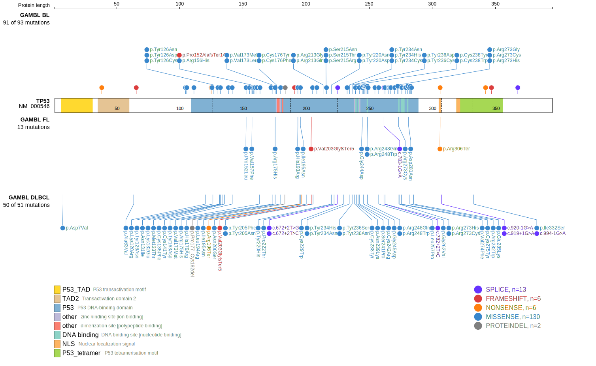

# TP53

## History

## Relevance tier by entity

|Entity|Tier|Description               |
|:------:|:----:|--------------------------|
||1|high-confidence MZL gene[@rossiCodingGenomeSplenic2012c]|
||1|high-confidence PMBL/cHL/GZL gene[@tiacciPervasiveMutationsJAKSTAT2018b]|
|    |1   |high-confidence BL gene   [@wildaInactivationARFMDM2p53Pathway2004]|
| |1   |high-confidence DLBCL gene[@lohrDiscoveryPrioritizationSomatic2012a]|
|    |1   |high-confidence FL gene   [@morinFrequentMutationHistonemodifying2011]|
|   |1   |high-confidence MCL gene  [@beaLandscapeSomaticMutations2013]|

## Mutation incidence in large patient cohorts (GAMBL reanalysis)

|Entity|source               |frequency (%)|
|:------:|:---------------------:|:-------------:|
|BL    |GAMBL genomes+capture|45.50        |
|BL    |Thomas cohort        |41.90        |
|BL    |Panea cohort         |43.60        |
|DLBCL |GAMBL genomes        |27.53        |
|DLBCL |Schmitz cohort       |22.34        |
|DLBCL |Reddy cohort         |10.91        |
|DLBCL |Chapuy cohort        |21.37        |
|FL    |GAMBL genomes        | 6.93        |
|MCL   |GAMBL genomes        | 9.00        |

## Mutation pattern and selective pressure estimates

|Entity|aSHM|Significant selection|dN/dS (missense)|dN/dS (nonsense)|
|:------:|:----:|:---------------------:|:----------------:|:----------------:|
|BL    |No  |Yes                  | 83.783         | 58.309         |
|DLBCL |No  |Yes                  |127.531         |143.760         |
|FL    |No  |Yes                  | 63.211         |142.226         |

View coding variants in ProteinPaint [hg19](https://morinlab.github.io/LLMPP/GAMBL/TP53_protein.html)  or [hg38](https://morinlab.github.io/LLMPP/GAMBL/TP53_protein_hg38.html)

View all variants in GenomePaint [hg19](https://morinlab.github.io/LLMPP/GAMBL/TP53.html)  or [hg38](https://morinlab.github.io/LLMPP/GAMBL/TP53_hg38.html)

## TP53 Expression

<!-- ORIGIN: wildaInactivationARFMDM2p53Pathway2004 -->
<!-- BL: wildaInactivationARFMDM2p53Pathway2004 -->
<!-- FL: morinFrequentMutationHistonemodifying2011 -->
<!-- BL: wildaInactivationARFMDM2p53Pathway2004 -->
<!-- MCL: beaLandscapeSomaticMutations2013 -->
<!-- MZL: rossiCodingGenomeSplenic2012c -->
<!-- PMBL: tiacciPervasiveMutationsJAKSTAT2018b -->

## References
