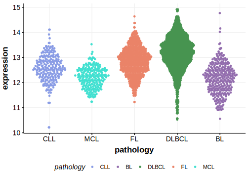

[[_TOC_]]

## Relevance tier by entity

[[include:tables/table1_TPP1.md]]

## Mutation incidence in large patient cohorts (GAMBL reanalysis)

|Entity|source       |frequency (%)|
|:------:|:-------------:|:-------------:|
|FL    |GAMBL genomes|0.92         |

## Mutation pattern and selective pressure estimates

[[include:tables/dnds_TPP1.md]]

[[include:tables/browser_TPP1.md]]

## Expression

<!-- ORIGIN: hubschmannMutationalMechanismsShaping2021b -->
<!-- FL: hubschmannMutationalMechanismsShaping2021b -->

## All Mutations

[SP192863](https://www.bcgsc.ca/downloads/morinlab/GAMBL/MALY/SP192863.html)
[SP193093](https://www.bcgsc.ca/downloads/morinlab/GAMBL/MALY/SP193093.html)
[SP193744](https://www.bcgsc.ca/downloads/morinlab/GAMBL/MALY/SP193744.html)
[SP194043](https://www.bcgsc.ca/downloads/morinlab/GAMBL/MALY/SP194043.html)
[SP59416](https://www.bcgsc.ca/downloads/morinlab/GAMBL/MALY/SP59416.html)

[[include:tables/mermaid_TPP1.md]]

## References

