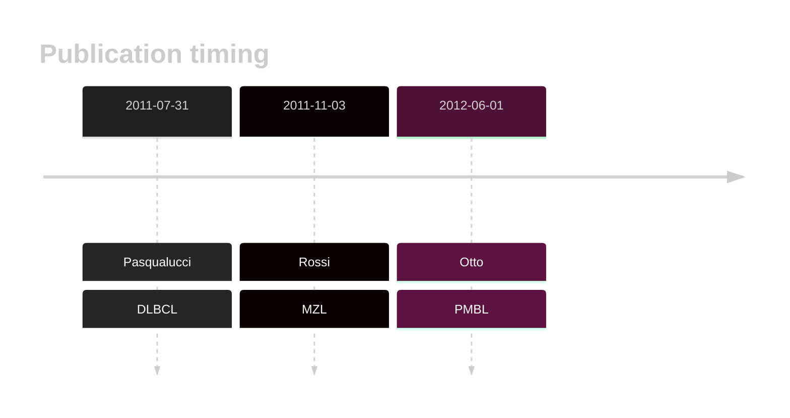

# TRAF3

## History

## Relevance tier by entity

|Entity|Tier|Description                              |
|:------:|:----:|-----------------------------------------|
||1|high-confidence PMBL/cHL/GZL gene|
||1|high-confidence MZL gene|
| |2   |relevance in DLBCL not firmly established|

## Mutation incidence in large patient cohorts (GAMBL reanalysis)

|Entity|source        |frequency (%)|
|:------:|:--------------:|:-------------:|
|DLBCL |GAMBL genomes |0.96         |
|DLBCL |Schmitz cohort|1.49         |
|DLBCL |Reddy cohort  |0.90         |
|DLBCL |Chapuy cohort |0.43         |

## Mutation pattern and selective pressure estimates

|Entity|aSHM|Significant selection|dN/dS (missense)|dN/dS (nonsense)|
|:------:|:----:|:---------------------:|:----------------:|:----------------:|
|BL    |No  |No                   |0.795           |0               |
|DLBCL |No  |No                   |1.440           |0               |
|FL    |No  |No                   |0.000           |0               |

View coding variants in ProteinPaint [hg19](https://morinlab.github.io/LLMPP/GAMBL/TRAF3_protein.html)  or [hg38](https://morinlab.github.io/LLMPP/GAMBL/TRAF3_protein_hg38.html)

View all variants in GenomePaint [hg19](https://morinlab.github.io/LLMPP/GAMBL/TRAF3.html)  or [hg38](https://morinlab.github.io/LLMPP/GAMBL/TRAF3_hg38.html)

## TRAF3 Expression

<!-- ORIGIN: rossiAlterationBIRC3Multiple2011a -->
<!-- MZL: rossiAlterationBIRC3Multiple2011a -->
<!-- DLBCL: pasqualucciAnalysisCodingGenome2011 -->
<!-- PMBL: ottoGeneticLesionsTRAF32012a -->

## References
1.  Pasqualucci L, Trifonov V, Fabbri G, Ma J, Rossi D, Chiarenza A, Wells VA, Grunn A, Messina M, Elliot O, Chan J, Bhagat G, Chadburn A, Gaidano G, Mullighan CG, Rabadan R, Dalla-Favera R. Analysis of the coding genome of diffuse large B-cell lymphoma. Nat Genet. 2011 Jul 31;43(9):830–837. PMCID: PMC3297422
2.  Rossi D, Deaglio S, Dominguez-Sola D, Rasi S, Vaisitti T, Agostinelli C, Spina V, Bruscaggin A, Monti S, Cerri M, Cresta S, Fangazio M, Arcaini L, Lucioni M, Marasca R, Thieblemont C, Capello D, Facchetti F, Kwee I, Pileri SA, Foà R, Bertoni F, Dalla-Favera R, Pasqualucci L, Gaidano G. Alteration of BIRC3 and multiple other NF-κB pathway genes in splenic marginal zone lymphoma. Blood. 2011 Nov 3;118(18):4930–4934. PMID: 21881048
3.  Otto C, Giefing M, Massow A, Vater I, Gesk S, Schlesner M, Richter J, Klapper W, Hansmann ML, Siebert R, Küppers R. Genetic lesions of the TRAF3 and MAP3K14 genes in classical Hodgkin lymphoma. Br J Haematol. 2012 Jun;157(6):702–708. PMID: 22469134
