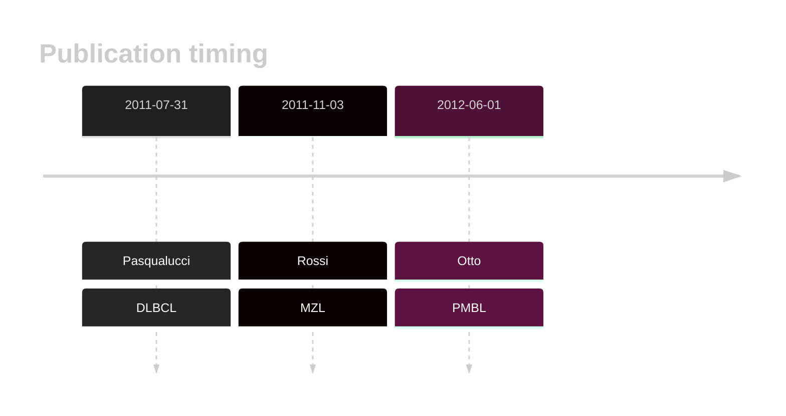

# TRAF3

## History

## Relevance tier by entity

|Entity|Tier|Description                              |
|:------:|:----:|-----------------------------------------|
||1|high-confidence PMBL/cHL/GZL gene[@ottoGeneticLesionsTRAF32012]|
||1|high-confidence MZL gene[@rossiAlterationBIRC3Multiple2011]|
| |2   |relevance in DLBCL not firmly established[@pasqualucciAnalysisCodingGenome2011]|

## Mutation incidence in large patient cohorts (GAMBL reanalysis)

|Entity|source        |frequency (%)|
|:------:|:--------------:|:-------------:|
|DLBCL |GAMBL genomes |0.96         |
|DLBCL |Schmitz cohort|1.49         |
|DLBCL |Reddy cohort  |0.90         |
|DLBCL |Chapuy cohort |0.43         |

## Mutation pattern and selective pressure estimates

|Entity|aSHM|Significant selection|dN/dS (missense)|dN/dS (nonsense)|
|:------:|:----:|:---------------------:|:----------------:|:----------------:|
|BL    |No  |No                   |0.795           |0               |
|DLBCL |No  |No                   |1.440           |0               |
|FL    |No  |No                   |0.000           |0               |

View coding variants in ProteinPaint [hg19](https://morinlab.github.io/LLMPP/GAMBL/TRAF3_protein.html)  or [hg38](https://morinlab.github.io/LLMPP/GAMBL/TRAF3_protein_hg38.html)

View all variants in GenomePaint [hg19](https://morinlab.github.io/LLMPP/GAMBL/TRAF3.html)  or [hg38](https://morinlab.github.io/LLMPP/GAMBL/TRAF3_hg38.html)

## TRAF3 Expression

<!-- ORIGIN: rossiAlterationBIRC3Multiple2011a -->
<!-- MZL: rossiAlterationBIRC3Multiple2011a -->
<!-- DLBCL: pasqualucciAnalysisCodingGenome2011 -->
<!-- PMBL: ottoGeneticLesionsTRAF32012a -->

## References
