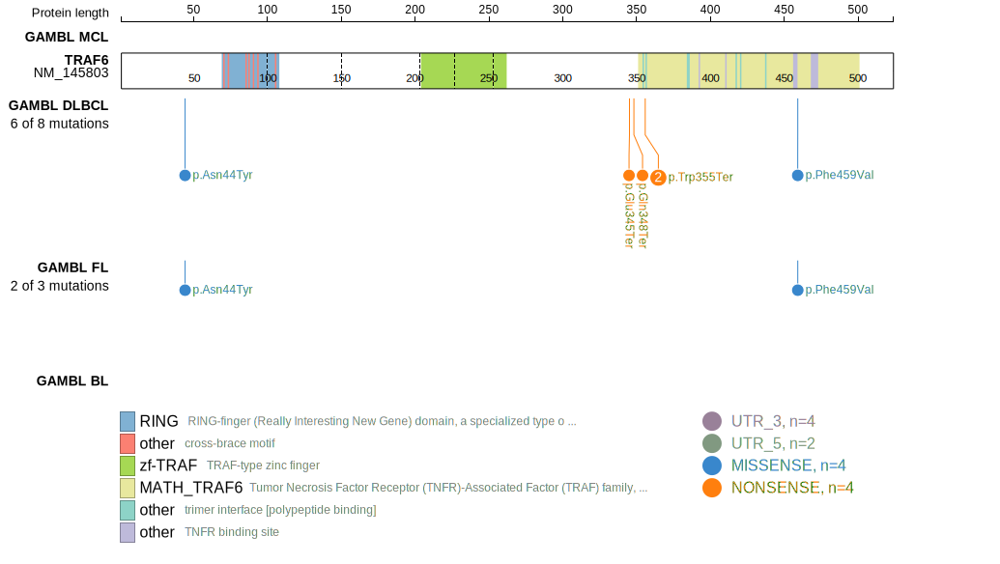
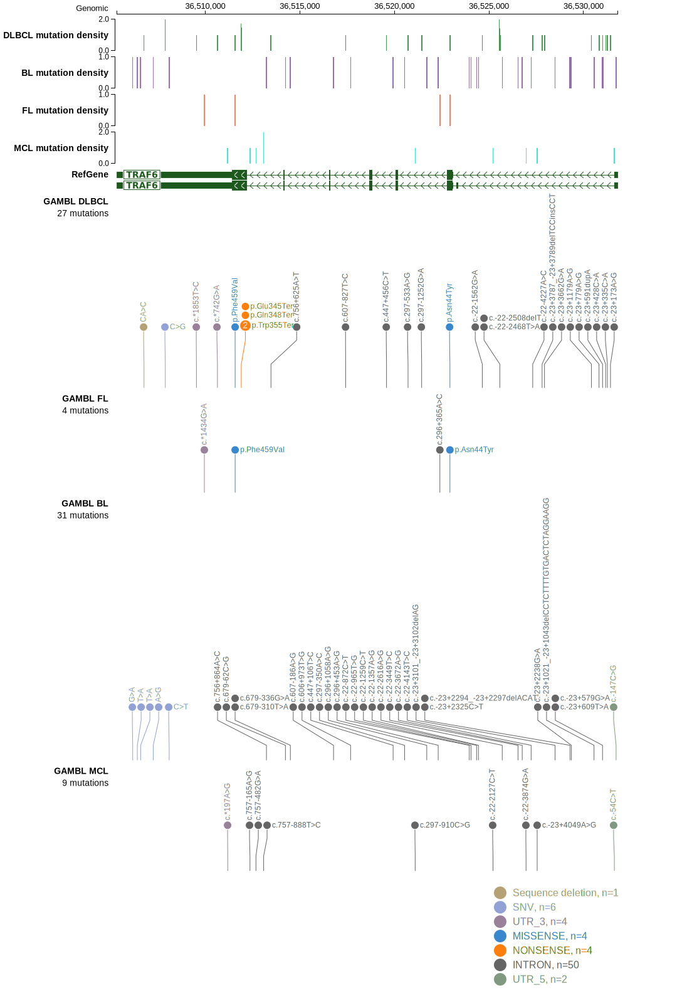

# TRAF6

## Relevance tier by entity

|Entity|Tier|Description                              |
|:------:|:----:|-----------------------------------------|
|DLBCL |2   |relevance in DLBCL not firmly established|

## Mutation incidence in large patient cohorts (GAMBL reanalysis)

|Entity|source        |frequency (%)|
|:------:|:--------------:|:-------------:|
|DLBCL |GAMBL genomes |1.34         |
|DLBCL |Schmitz cohort|1.49         |
|DLBCL |Reddy cohort  |0.90         |
|DLBCL |Chapuy cohort |1.28         |

## Mutation pattern and selective pressure estimates

|Entity|aSHM|Significant selection|dN/dS (missense)|dN/dS (nonsense)|
|:------:|:----:|:---------------------:|:----------------:|:----------------:|
|BL    |No  |No                   |0.000           | 0.000          |
|DLBCL |No  |No                   |1.970           |61.299          |
|FL    |No  |No                   |9.831           | 0.000          |

> [!NOTE]
> First described in DLBCL in 2021 by [Hübschmann D](https://pubmed.ncbi.nlm.nih.gov/33953289)

 ## TRAF6 Hotspots

| Chromosome |Coordinate (hg19) | ref>alt | HGVSp | 
 | :---:| :---: | :--: | :---: |
| chr11 | 36511924 | C>A | E345* |
| chr11 | 36511915 | G>A | Q348* |
| chr11 | 36511893 | C>T | W355* |
| chr11 | 36511892 | C>T | W355* |

View coding variants in ProteinPaint [hg19](https://morinlab.github.io/LLMPP/GAMBL/TRAF6_protein.html)  or [hg38](https://morinlab.github.io/LLMPP/GAMBL/TRAF6_protein_hg38.html)

View all variants in GenomePaint [hg19](https://morinlab.github.io/LLMPP/GAMBL/TRAF6.html)  or [hg38](https://morinlab.github.io/LLMPP/GAMBL/TRAF6_hg38.html)

