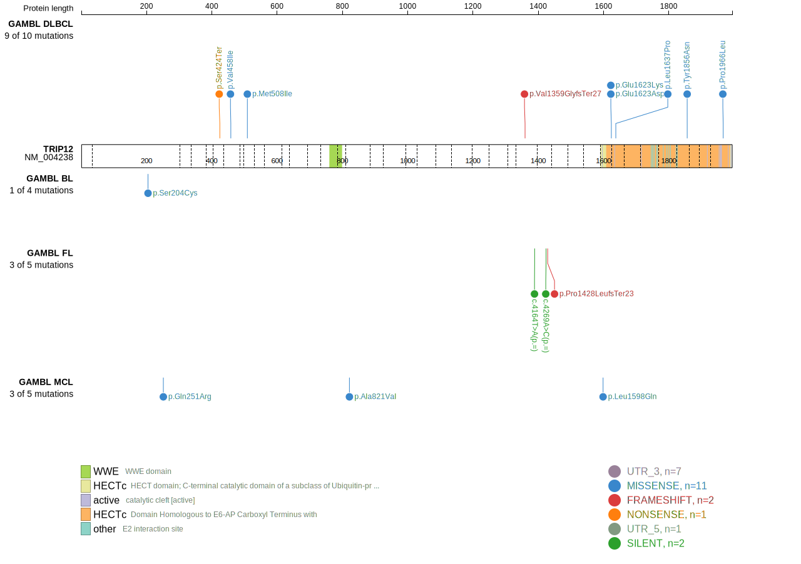
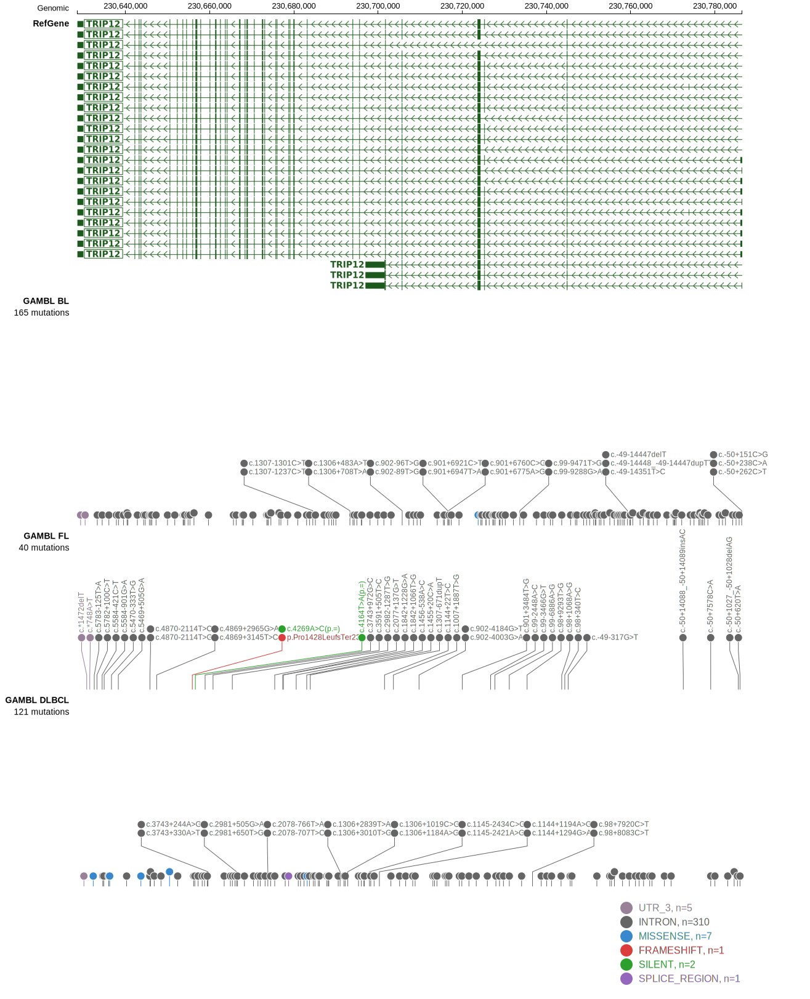
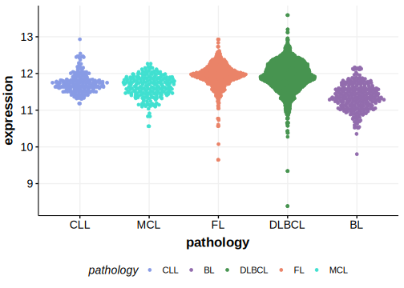

# TRIP12

## Relevance tier by entity

|Entity|Tier|Description               |
|:------:|:----:|--------------------------|
|DLBCL |1   |high-confidence DLBCL gene|

## Mutation incidence in large patient cohorts (GAMBL reanalysis)

|Entity|source        |frequency (%)|
|:------:|:--------------:|:-------------:|
|DLBCL |GAMBL genomes |3.25         |
|DLBCL |Schmitz cohort|5.96         |
|DLBCL |Reddy cohort  |3.20         |
|DLBCL |Chapuy cohort |2.99         |

## Mutation pattern and selective pressure estimates

|Entity|aSHM|Significant selection|dN/dS (missense)|dN/dS (nonsense)|
|:------:|:----:|:---------------------:|:----------------:|:----------------:|
|BL    |No  |No                   |0.620           |0               |
|DLBCL |No  |No                   |1.161           |0               |
|FL    |No  |No                   |0.000           |0               |

View coding variants in ProteinPaint [hg19](https://morinlab.github.io/LLMPP/GAMBL/TRIP12_protein.html)  or [hg38](https://morinlab.github.io/LLMPP/GAMBL/TRIP12_protein_hg38.html)

View all variants in GenomePaint [hg19](https://morinlab.github.io/LLMPP/GAMBL/TRIP12.html)  or [hg38](https://morinlab.github.io/LLMPP/GAMBL/TRIP12_hg38.html)

## TRIP12 Expression

<!-- ORIGIN: Unknown -->
