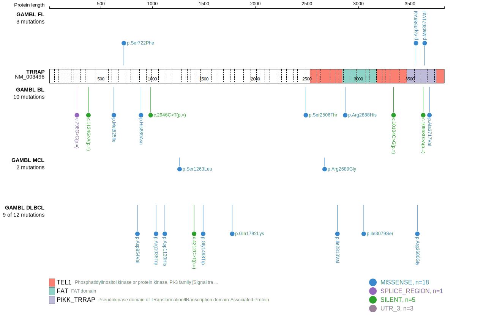
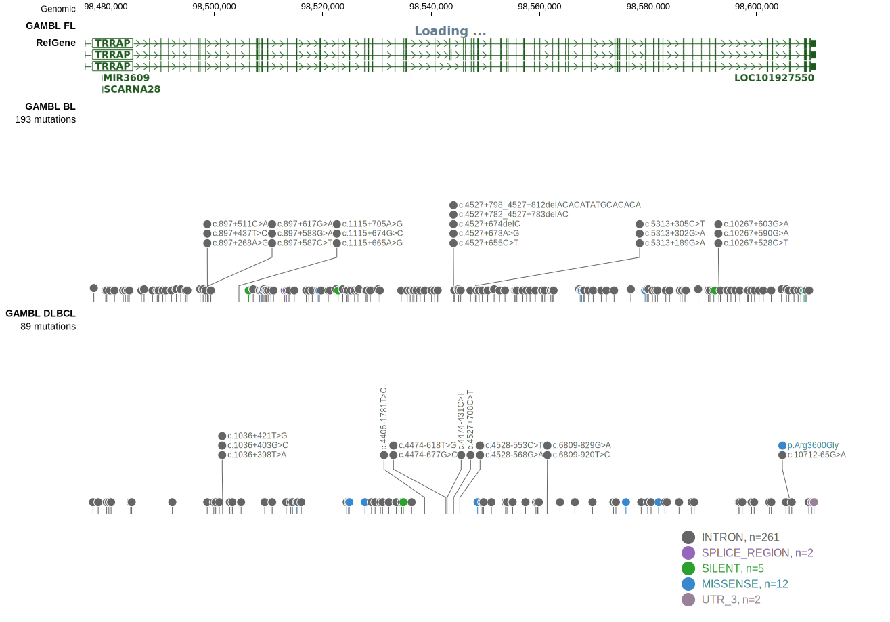
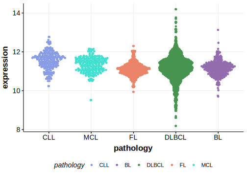

# TRRAP

## Relevance tier by entity

|Entity|Tier|Description               |
|:------:|:----:|--------------------------|
|DLBCL |1   |high-confidence DLBCL gene|

## Mutation incidence in large patient cohorts (GAMBL reanalysis)

|Entity|source        |frequency (%)|
|:------:|:--------------:|:-------------:|
|DLBCL |GAMBL genomes |2.87         |
|DLBCL |Schmitz cohort|8.94         |
|DLBCL |Reddy cohort  |3.50         |
|DLBCL |Chapuy cohort |5.98         |

## Mutation pattern and selective pressure estimates

|Entity|aSHM|Significant selection|dN/dS (missense)|dN/dS (nonsense)|
|:------:|:----:|:---------------------:|:----------------:|:----------------:|
|BL    |No  |No                   |0.571           |0               |
|DLBCL |No  |No                   |1.296           |0               |
|FL    |No  |No                   |2.757           |0               |

 ## TRRAP Hotspots

| Chromosome |Coordinate (hg19) | ref>alt | HGVSp | 
 | :---:| :---: | :--: | :---: |
| chr7 | 98509802 | C>T | S722F |

View coding variants in ProteinPaint [hg19](https://morinlab.github.io/LLMPP/GAMBL/TRRAP_protein.html)  or [hg38](https://morinlab.github.io/LLMPP/GAMBL/TRRAP_protein_hg38.html)

View all variants in GenomePaint [hg19](https://morinlab.github.io/LLMPP/GAMBL/TRRAP.html)  or [hg38](https://morinlab.github.io/LLMPP/GAMBL/TRRAP_hg38.html)

## TRRAP Expression

