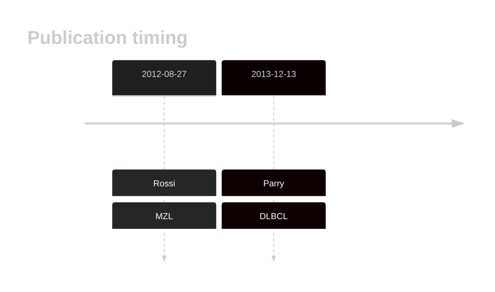

# TRRAP

## History

## Relevance tier by entity

|Entity|Tier|Description               |
|:------:|:----:|--------------------------|
||2|relevance in MZL not firmly established|
| |1   |high-confidence DLBCL gene|

## Mutation incidence in large patient cohorts (GAMBL reanalysis)

|Entity|source        |frequency (%)|
|:------:|:--------------:|:-------------:|
|DLBCL |GAMBL genomes |2.87         |
|DLBCL |Schmitz cohort|8.94         |
|DLBCL |Reddy cohort  |3.50         |
|DLBCL |Chapuy cohort |5.98         |

## Mutation pattern and selective pressure estimates

|Entity|aSHM|Significant selection|dN/dS (missense)|dN/dS (nonsense)|
|:------:|:----:|:---------------------:|:----------------:|:----------------:|
|BL    |No  |No                   |0.571           |0               |
|DLBCL |No  |No                   |1.296           |0               |
|FL    |No  |No                   |2.757           |0               |

 ## TRRAP Hotspots

| Chromosome |Coordinate (hg19) | ref>alt | HGVSp | 
 | :---:| :---: | :--: | :---: |
| chr7 | 98509802 | C>T | S722F |

View coding variants in ProteinPaint [hg19](https://morinlab.github.io/LLMPP/GAMBL/TRRAP_protein.html)  or [hg38](https://morinlab.github.io/LLMPP/GAMBL/TRRAP_protein_hg38.html)

View all variants in GenomePaint [hg19](https://morinlab.github.io/LLMPP/GAMBL/TRRAP.html)  or [hg38](https://morinlab.github.io/LLMPP/GAMBL/TRRAP_hg38.html)

## TRRAP Expression

<!-- ORIGIN: rossiCodingGenomeSplenic2012c -->
<!-- DLBCL: parryWholeExomeSequencing2013 -->
<!-- MZL: rossiCodingGenomeSplenic2012c -->

## References
1.  Rossi D, Trifonov V, Fangazio M, Bruscaggin A, Rasi S, Spina V, Monti S, Vaisitti T, Arruga F, Famà R, Ciardullo C, Greco M, Cresta S, Piranda D, Holmes A, Fabbri G, Messina M, Rinaldi A, Wang J, Agostinelli C, Piccaluga PP, Lucioni M, Tabbò F, Serra R, Franceschetti S, Deambrogi C, Daniele G, Gattei V, Marasca R, Facchetti F, Arcaini L, Inghirami G, Bertoni F, Pileri SA, Deaglio S, Foà R, Dalla-Favera R, Pasqualucci L, Rabadan R, Gaidano G. The coding genome of splenic marginal zone lymphoma: activation of NOTCH2 and other pathways regulating marginal zone development. J Exp Med. 2012 Aug 27;209(9):1537–1551. PMCID: PMC3428941
2.  Parry M, Rose-Zerilli MJJ, Gibson J, Ennis S, Walewska R, Forster J, Parker H, Davis Z, Gardiner A, Collins A, Oscier DG, Strefford JC. Whole exome sequencing identifies novel recurrently mutated genes in patients with splenic marginal zone lymphoma. PLoS One. 2013;8(12):e83244. PMCID: PMC3862727
