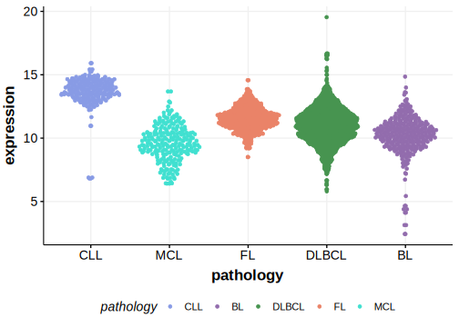

[[_TOC_]]

## Relevance tier by entity

[[include:table1_TTN.md]]

## Mutation incidence in large patient cohorts (GAMBL reanalysis)

|Entity|source               |frequency (%)|
|:------:|:---------------------:|:-------------:|
|BL    |GAMBL genomes+capture|28.64        |
|BL    |Thomas cohort        |   NA        |
|BL    |Panea cohort         |   NA        |

## Mutation pattern and selective pressure estimates

[[include:tables/dnds_TTN.md]]

## TTN Hotspots

| Chromosome |Coordinate (hg19) | ref>alt | HGVSp | 
 | :---:| :---: | :--: | :---: |
| chr2 | 179638249 | C>T | E2512K |

[[include:browser_TTN.md]]

## Expression

<!-- ORIGIN: burkhardtClinicalRelevanceMolecular2022b -->
<!-- BL: burkhardtClinicalRelevanceMolecular2022b -->

[[include:mermaid_TTN.md]]

## References
