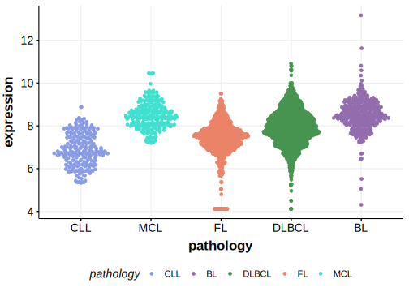

[[_TOC_]]

## Overview

## Relevance tier by entity

|Entity|Tier|Description                           |
|:------:|:----:|--------------------------------------|
| |1[@balSuperenhancerHypermutationAlters2022]   |high-confidence DLBCL gene            [@tanakaFrequentIncidenceSomatic1992]|
|    |1   |high-confidence FL gene| 
||2|relevance in PMBL/cHL/GZL not firmly established[@sarkozyMutationalLandscapeGray2021]|
|    |2   |relevance in BL not firmly established[@burkhardtClinicalRelevanceMolecular2022]|

## Warnings

*may not exist*

## Mutation incidence from meta-analysis
*sub headings per file here unless there is just one*

### DLBCL
[[include:DLBCL_BCL2.md]]

### FL
[[include:FL_BCL2.md]]

### BL
[[include:BL_BCL2.md]]

## Mutation pattern and selective pressure estimates

[[include:dnds_BCL2.md]]

## aSHM regions

*section will only exist for certain genes*

|chr_name|hg19_start|hg19_end|region|regulatory_comment|
|:--------:|:----------:|:--------:|:--------:|:------------------:|
|chr6    |90981034  |91016134|[TSS](https://genome.ucsc.edu/s/rdmorin/GAMBL%20hg19?position=chr6%3A90981034%2D91016134)|NA|

## Hotspots

*section will only exist for certain genes*

[[include:Template_Browser.md]]

## Expression

[[include:Template_History.md]]

## References

