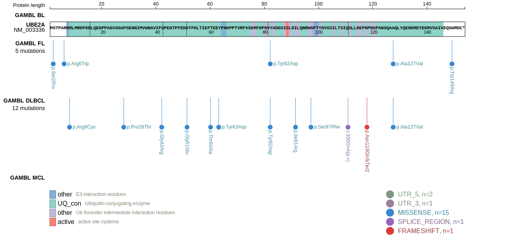
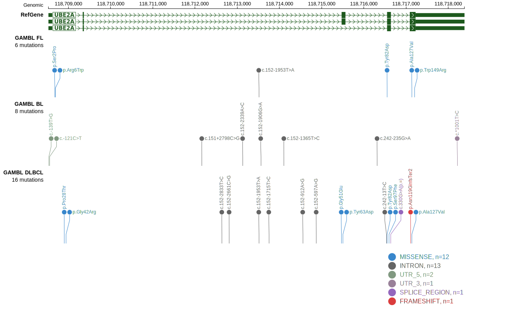

# [UBE2A]

## Mutation tier

|Entity|Tier|Description                           |
|:------:|:----:|--------------------------------------|
|BL    |2   |relevance in BL not firmly established|
|DLBCL |1   |high-confidence DLBCL gene            |
## Mutation incidence

|Entity|source               |frequency (%)|
|:------:|:---------------------:|:-------------:|
|BL    |GAMBL genomes+capture|0.92         |
|BL    |Thomas cohort        |0.00         |
|BL    |Panea cohort         |3.00         |
|DLBCL |GAMBL genomes        |4.21         |
|DLBCL |Schmitz cohort       |7.02         |
|DLBCL |Reddy cohort         |3.90         |
|DLBCL |Chapuy cohort        |4.70         |

## Mutation pattern

|Entity|aSHM|Significant selection|dN/dS (missense)|dN/dS (nonsense)|
|:------:|:----:|:---------------------:|:----------------:|:----------------:|
|BL    |No  |No                   | 0.000          |0               |
|DLBCL |No  |Yes                  |26.609          |0               |
|FL    |No  |No                   |51.360          |0               |

View coding variants in ProteinPaint [hg19](https://www.bcgsc.ca/downloads/morinlab/GAMBL/test/genes/UBE2A_protein.html)  or [hg38](https://www.bcgsc.ca/downloads/morinlab/GAMBL/test/genes/UBE2A_protein_hg38.html)

View all variants in GenomePaint [hg19](https://www.bcgsc.ca/downloads/morinlab/GAMBL/test/genes/UBE2A.html)  or [hg38](https://www.bcgsc.ca/downloads/morinlab/GAMBL/test/genes/UBE2A_hg38.html)

