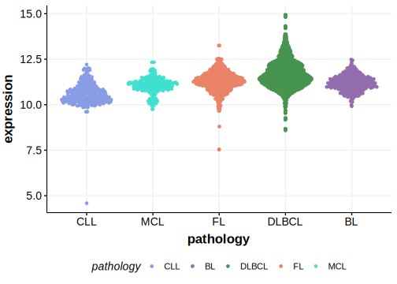

# UBE2A

## History

## Relevance tier by entity

|Entity|Tier|Description                           |
|:------:|:----:|--------------------------------------|
||1|high-confidence PMBL/cHL/GZL gene[@reichelFlowSortingExome2015a]|
| |1   |high-confidence DLBCL gene            [@lohrDiscoveryPrioritizationSomatic2012a; @albuquerqueEnhancingKnowledgeDiscovery2017a; @reddyGeneticFunctionalDrivers2017]|

## Mutation incidence in large patient cohorts (GAMBL reanalysis)

|Entity|source               |frequency (%)|
|:------:|:---------------------:|:-------------:|
|DLBCL |GAMBL genomes        |4.21         |
|DLBCL |Schmitz cohort       |7.02         |
|DLBCL |Reddy cohort         |3.90         |
|DLBCL |Chapuy cohort        |4.70         |

## Mutation pattern and selective pressure estimates

|Entity|aSHM|Significant selection|dN/dS (missense)|dN/dS (nonsense)|
|:------:|:----:|:---------------------:|:----------------:|:----------------:|
|BL    |No  |No                   | 0.000          |0               |
|DLBCL |No  |Yes                  |26.609          |0               |
|FL    |No  |No                   |51.360          |0               |

View coding variants in ProteinPaint [hg19](https://morinlab.github.io/LLMPP/GAMBL/UBE2A_protein.html)  or [hg38](https://morinlab.github.io/LLMPP/GAMBL/UBE2A_protein_hg38.html)

View all variants in GenomePaint [hg19](https://morinlab.github.io/LLMPP/GAMBL/UBE2A.html)  or [hg38](https://morinlab.github.io/LLMPP/GAMBL/UBE2A_hg38.html)

## UBE2A Expression

<!-- ORIGIN: reichelFlowSortingExome2015a -->
<!-- DLBCL: reddyGeneticFunctionalDrivers2017 -->
<!-- PMBL: reichelFlowSortingExome2015a -->

## References
 
