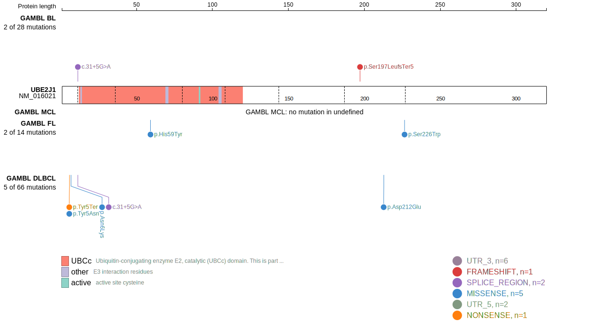
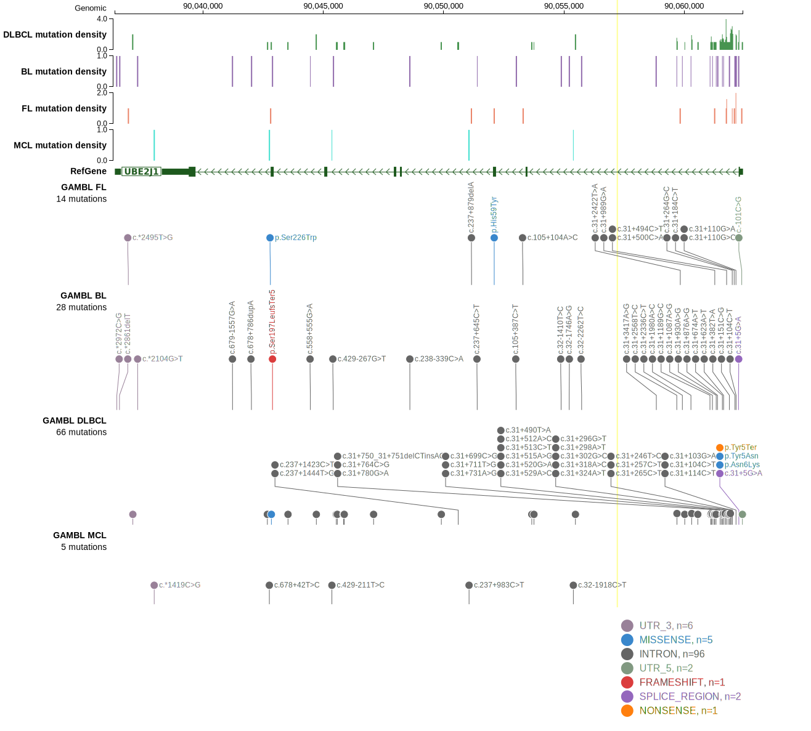
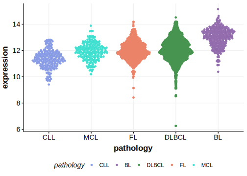

# UBE2J1

## Relevance tier by entity

|Entity|Tier|Description                              |
|:------:|:----:|-----------------------------------------|
| |2-a | aSHM target; Although recurrent, the relevance of mutations in DLBCL is tenuous |

## Mutation incidence in large patient cohorts (GAMBL reanalysis)

|Entity|source        |frequency (%)|
|:------:|:--------------:|:-------------:|
|DLBCL |GAMBL genomes |0.76         |
|DLBCL |Schmitz cohort|1.28         |
|DLBCL |Reddy cohort  |0.80         |
|DLBCL |Chapuy cohort |0.43         |

## Mutation pattern and selective pressure estimates

|Entity|aSHM|Significant selection|dN/dS (missense)|dN/dS (nonsense)|
|:------:|:----:|:---------------------:|:----------------:|:----------------:|
|BL    |Yes |No                   | 0.000          |22.392          |
|DLBCL |Yes |No                   | 0.000          |11.415          |
|FL    |Yes |No                   |12.947          | 0.000          |

## aSHM regions

|chr_name|hg19_start|hg19_end|region                                                                                   |regulatory_comment|
|:--------:|:----------:|:--------:|:-----------------------------------------------------------------------------------------:|:------------------:|
|chr6    |90059730  |90063703|[TSS](https://genome.ucsc.edu/s/rdmorin/GAMBL%20hg19?position=chr6%3A90059730%2D90063703)|NA                |

View coding variants in ProteinPaint [hg19](https://morinlab.github.io/LLMPP/GAMBL/UBE2J1_protein.html)  or [hg38](https://morinlab.github.io/LLMPP/GAMBL/UBE2J1_protein_hg38.html)

View all variants in GenomePaint [hg19](https://morinlab.github.io/LLMPP/GAMBL/UBE2J1.html)  or [hg38](https://morinlab.github.io/LLMPP/GAMBL/UBE2J1_hg38.html)

## UBE2J1 Expression

<!-- ORIGIN: Unknown -->

## References
