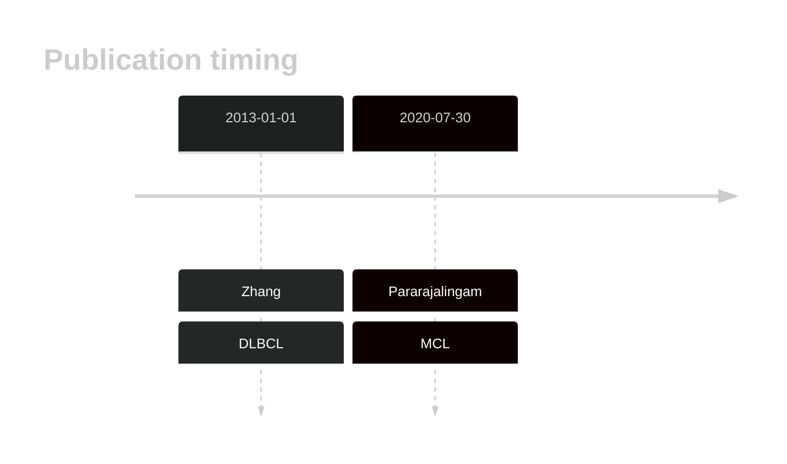

# UBR5

## History

## Relevance tier by entity

|Entity|Tier|Description                              |
|:------:|:----:|-----------------------------------------|
||1|high-confidence PMBL/cHL/GZL gene|
| |2   |relevance in DLBCL not firmly established[@zhangGeneticHeterogeneityDiffuse2013]|
|   |1   |high-confidence MCL gene                 [@pararajalingamCodingNoncodingDrivers2020]|

## Mutation incidence in large patient cohorts (GAMBL reanalysis)

|Entity|source        |frequency (%)|
|:------:|:--------------:|:-------------:|
|DLBCL |GAMBL genomes |3.63         |
|DLBCL |Schmitz cohort|5.53         |
|DLBCL |Reddy cohort  |3.20         |
|DLBCL |Chapuy cohort |5.13         |
|MCL   |GAMBL genomes |9.00         |

## Mutation pattern and selective pressure estimates

|Entity|aSHM|Significant selection|dN/dS (missense)|dN/dS (nonsense)|
|:------:|:----:|:---------------------:|:----------------:|:----------------:|
|BL    |No  |No                   |0.678           |1.875           |
|DLBCL |No  |No                   |1.342           |5.285           |
|FL    |No  |No                   |0.918           |6.988           |

View coding variants in ProteinPaint [hg19](https://morinlab.github.io/LLMPP/GAMBL/UBR5_protein.html)  or [hg38](https://morinlab.github.io/LLMPP/GAMBL/UBR5_protein_hg38.html)

View all variants in GenomePaint [hg19](https://morinlab.github.io/LLMPP/GAMBL/UBR5.html)  or [hg38](https://morinlab.github.io/LLMPP/GAMBL/UBR5_hg38.html)

## UBR5 Expression

<!-- ORIGIN: zhangGeneticHeterogeneityDiffuse2013 -->
<!-- DLBCL: zhangGeneticHeterogeneityDiffuse2013 -->
<!-- MCL: pararajalingamCodingNoncodingDrivers2020 -->

## References

