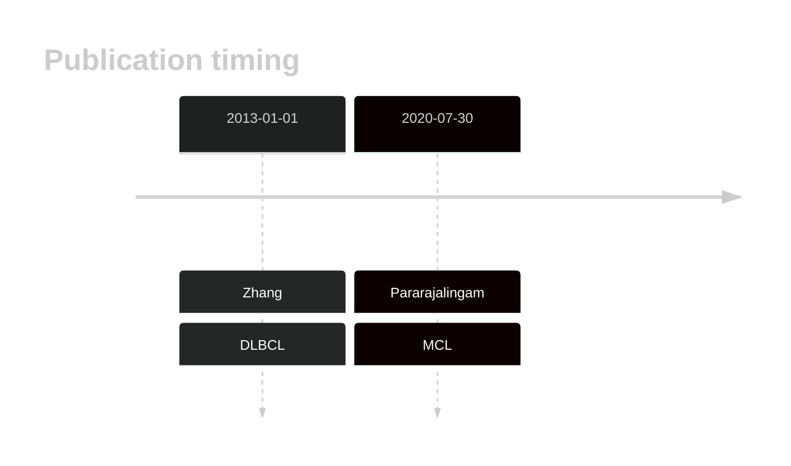

# UBR5
## History

## Relevance tier by entity

|Entity|Tier|Description                              |
|:------:|:----:|-----------------------------------------|
||1|high-confidence PMBL/cHL/GZL gene|
| |2   |relevance in DLBCL not firmly established|
|   |1   |high-confidence MCL gene                 |

## Mutation incidence in large patient cohorts (GAMBL reanalysis)

|Entity|source        |frequency (%)|
|:------:|:--------------:|:-------------:|
|DLBCL |GAMBL genomes |3.63         |
|DLBCL |Schmitz cohort|5.53         |
|DLBCL |Reddy cohort  |3.20         |
|DLBCL |Chapuy cohort |5.13         |
|MCL   |GAMBL genomes |9.00         |

## Mutation pattern and selective pressure estimates

|Entity|aSHM|Significant selection|dN/dS (missense)|dN/dS (nonsense)|
|:------:|:----:|:---------------------:|:----------------:|:----------------:|
|BL    |No  |No                   |0.678           |1.875           |
|DLBCL |No  |No                   |1.342           |5.285           |
|FL    |No  |No                   |0.918           |6.988           |

> [!NOTE]
> First described in DLBCL in 2013 by [Zhang J](https://pubmed.ncbi.nlm.nih.gov/23292937). First described in MCL in 2020 by [Pararajalingam P](https://pubmed.ncbi.nlm.nih.gov/32160292)

View coding variants in ProteinPaint [hg19](https://morinlab.github.io/LLMPP/GAMBL/UBR5_protein.html)  or [hg38](https://morinlab.github.io/LLMPP/GAMBL/UBR5_protein_hg38.html)

View all variants in GenomePaint [hg19](https://morinlab.github.io/LLMPP/GAMBL/UBR5.html)  or [hg38](https://morinlab.github.io/LLMPP/GAMBL/UBR5_hg38.html)

## UBR5 Expression

<!-- ORIGIN: zhangGeneticHeterogeneityDiffuse2013 -->
<!-- DLBCL: zhangGeneticHeterogeneityDiffuse2013 -->
<!-- MCL: pararajalingamCodingNoncodingDrivers2020 -->
## References
1.  Zhang J, Grubor V, Love CL, Banerjee A, Richards KL, Mieczkowski PA, Dunphy C, Choi W, Au WY, Srivastava G, Lugar PL, Rizzieri DA, Lagoo AS, Bernal-Mizrachi L, Mann KP, Flowers C, Naresh K, Evens A, Gordon LI, Czader M, Gill JI, Hsi ED, Liu Q, Fan A, Walsh K, Jima D, Smith LL, Johnson AJ, Byrd JC, Luftig MA, Ni T, Zhu J, Chadburn A, Levy S, Dunson D, Dave SS. Genetic heterogeneity of diffuse large B-cell lymphoma. 2013 Jan; 
2.  Pararajalingam P, Coyle KM, Arthur SE, Thomas N, Alcaide M, Meissner B, Boyle M, Qureshi Q, Grande BM, Rushton C, Slack GW, Mungall AJ, Tam CS, Agarwal R, Dawson SJ, Lenz G, Balasubramanian S, Gascoyne RD, Steidl C, Connors J, Villa D, Audas TE, Marra MA, Johnson NA, Scott DW, Morin RD. Coding and noncoding drivers of mantle cell lymphoma identified through exome and genome sequencing. Blood. 2020 Jul 30;136(5):572–584. PMCID: PMC7440974
