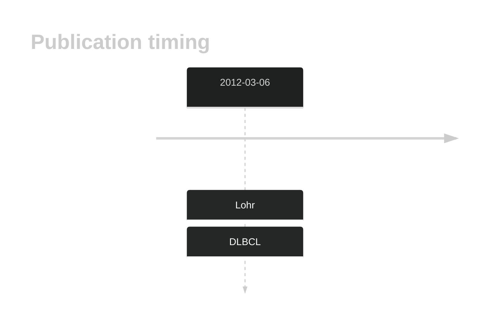

# UNC5C

## History

## Relevance tier by entity

|Entity|Tier|Description               |
|:------:|:----:|--------------------------|
||1|high-confidence PMBL/cHL/GZL gene|
| |2   |low-confidence DLBCL gene[@lohrDiscoveryPrioritizationSomatic2012a]|

## Mutation incidence in large patient cohorts (GAMBL reanalysis)

|Entity|source        |frequency (%)|
|:------:|:--------------:|:-------------:|
|DLBCL |GAMBL genomes |3.44         |
|DLBCL |Schmitz cohort|5.11         |
|DLBCL |Reddy cohort  |2.20         |
|DLBCL |Chapuy cohort |2.56         |

## Mutation pattern and selective pressure estimates

|Entity|aSHM|Significant selection|dN/dS (missense)|dN/dS (nonsense)|
|:------:|:----:|:---------------------:|:----------------:|:----------------:|
|BL    |No  |No                   |3.406           |0               |
|DLBCL |No  |No                   |1.948           |0               |
|FL    |No  |No                   |1.266           |0               |

View coding variants in ProteinPaint [hg19](https://morinlab.github.io/LLMPP/GAMBL/UNC5C_protein.html)  or [hg38](https://morinlab.github.io/LLMPP/GAMBL/UNC5C_protein_hg38.html)

View all variants in GenomePaint [hg19](https://morinlab.github.io/LLMPP/GAMBL/UNC5C.html)  or [hg38](https://morinlab.github.io/LLMPP/GAMBL/UNC5C_hg38.html)

## UNC5C Expression

<!-- ORIGIN: Unknown -->

## References
