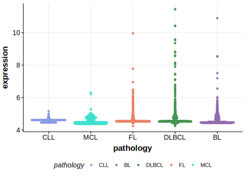

# UNC5D

## Relevance tier by entity

[[include:tables/table1_UNC5D.md]]

## Mutation incidence in large patient cohorts (GAMBL reanalysis)

|Entity|source        |frequency (%)|
|:------:|:--------------:|:-------------:|
|DLBCL |GAMBL genomes |2.10         |
|DLBCL |Schmitz cohort|1.91         |
|DLBCL |Reddy cohort  |1.80         |
|DLBCL |Chapuy cohort |2.56         |

## Mutation pattern and selective pressure estimates

[[include:tables/dnds_UNC5D.md]]

[[include:browser_UNC5D.md]]

## Expression

<!-- ORIGIN: Unknown -->

## References
