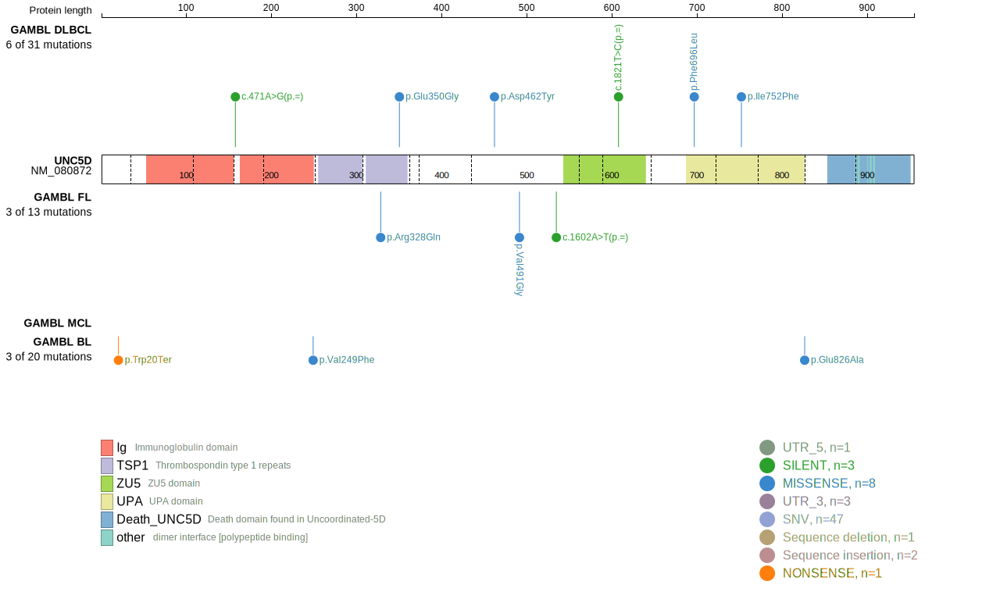

# UNC5D

## Relevance tier by entity

|Entity|Tier|Description               |
|:------:|:----:|--------------------------|
| | 2   |low-confidence DLBCL gene[@lohrDiscoveryPrioritizationSomatic2012]|

## Mutation incidence in large patient cohorts (GAMBL reanalysis)

|Entity|source        |frequency (%)|
|:------:|:--------------:|:-------------:|
|DLBCL |GAMBL genomes |2.10         |
|DLBCL |Schmitz cohort|1.91         |
|DLBCL |Reddy cohort  |1.80         |
|DLBCL |Chapuy cohort |2.56         |

## Mutation pattern and selective pressure estimates

|Entity|aSHM|Significant selection|dN/dS (missense)|dN/dS (nonsense)|
|:------:|:----:|:---------------------:|:----------------:|:----------------:|
|BL    |No  |No                   |0.954           |5.751           |
|DLBCL |No  |No                   |1.655           |2.419           |
|FL    |No  |No                   |1.545           |0.000           |

View coding variants in ProteinPaint [hg19](https://morinlab.github.io/LLMPP/GAMBL/UNC5D_protein.html)  or [hg38](https://morinlab.github.io/LLMPP/GAMBL/UNC5D_protein_hg38.html)

View all variants in GenomePaint [hg19](https://morinlab.github.io/LLMPP/GAMBL/UNC5D.html)  or [hg38](https://morinlab.github.io/LLMPP/GAMBL/UNC5D_hg38.html)

## UNC5D Expression

<!-- ORIGIN: Unknown -->

## References
