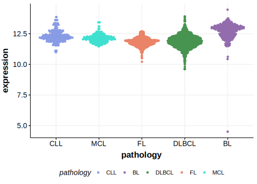

[[_TOC_]]

## Relevance tier by entity

|Entity|Tier|Description               |
|:------:|:----:|--------------------------|
|    |1   |high-confidence BL gene   [@grandeGenomewideDiscoverySomatic2019]|
| |2   |low-confidence DLBCL gene[@arthurGenomewideDiscoverySomatic2018]|

## Mutation incidence in large patient cohorts (GAMBL reanalysis)

[[include:DLBCL_USP7.md]]
[[include:BL_USP7.md]]

## Mutation pattern and selective pressure estimates

[[include:dnds_USP7.md]]

[[include:browser_USP7.md]]

## Expression

[[include:mermaid_USP7.md]]

## References

<!-- ORIGIN: grandeGenomewideDiscoverySomatic2019 -->
<!-- BL: grandeGenomewideDiscoverySomatic2019 -->
