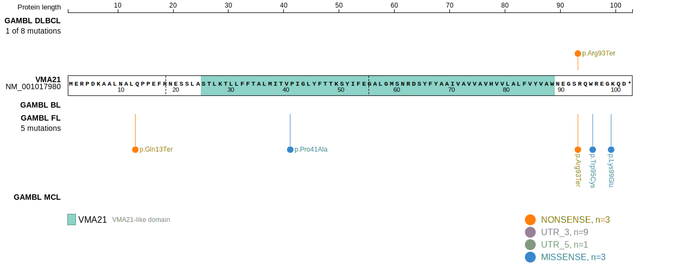
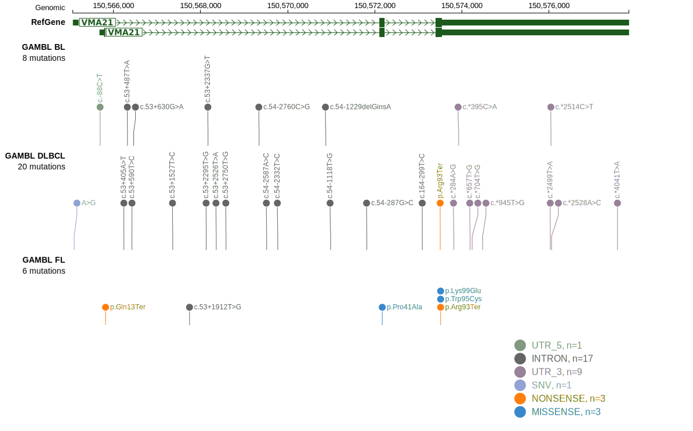
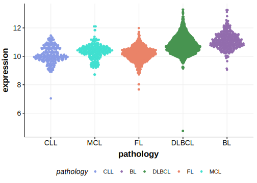

# VMA21

## Relevance tier by entity

|Entity|Tier|Description            |
|:------:|:----:|-----------------------|
|    |1   |high-confidence FL gene[@hubschmannMutationalMechanismsShaping2021]|

## Mutation incidence in large patient cohorts (GAMBL reanalysis)

### FL
[[include:FL_VMA21.md]]

### DLBCL
[[include:DLBCL_VMA21.md]]

## Mutation pattern and selective pressure estimates

[[include:dnds_VMA21.md]]

View coding variants in ProteinPaint [hg19](https://morinlab.github.io/LLMPP/GAMBL/VMA21_protein.html)  or [hg38](https://morinlab.github.io/LLMPP/GAMBL/VMA21_protein_hg38.html)

View all variants in GenomePaint [hg19](https://morinlab.github.io/LLMPP/GAMBL/VMA21.html)  or [hg38](https://morinlab.github.io/LLMPP/GAMBL/VMA21_hg38.html)

## VMA21 Expression

<!-- ORIGIN: hubschmannMutationalMechanismsShaping2021b -->
<!-- FL: hubschmannMutationalMechanismsShaping2021b -->

[[include:mermaid_VMA21.md]]

## References
