# VMA21

## History

```mermaid
%%{init: { 'logLevel': 'debug', 'theme': 'dark' } }%%
timeline
    title Publication timing
      2021-05-05 : Hübschmann : FL
```

## Relevance tier by entity

|Entity|Tier|Description            |
|:------:|:----:|-----------------------|
|    |1   |high-confidence FL gene[@hubschmannMutationalMechanismsShaping2021]|

## Mutation incidence in large patient cohorts (GAMBL reanalysis)

[[include:FL_VMA21.md]]

## Mutation pattern and selective pressure estimates

|Entity|aSHM|Significant selection|dN/dS (missense)|dN/dS (nonsense)|
|:------:|:----:|:---------------------:|:----------------:|:----------------:|
|BL    |No  |No                   | 0.000          |  0.000         |
|DLBCL |No  |No                   | 3.430          | 81.281         |
|FL    |No  |Yes                  |25.632          |598.612         |

View coding variants in ProteinPaint [hg19](https://morinlab.github.io/LLMPP/GAMBL/VMA21_protein.html)  or [hg38](https://morinlab.github.io/LLMPP/GAMBL/VMA21_protein_hg38.html)

View all variants in GenomePaint [hg19](https://morinlab.github.io/LLMPP/GAMBL/VMA21.html)  or [hg38](https://morinlab.github.io/LLMPP/GAMBL/VMA21_hg38.html)

## VMA21 Expression

<!-- ORIGIN: hubschmannMutationalMechanismsShaping2021b -->
<!-- FL: hubschmannMutationalMechanismsShaping2021b -->

## References
