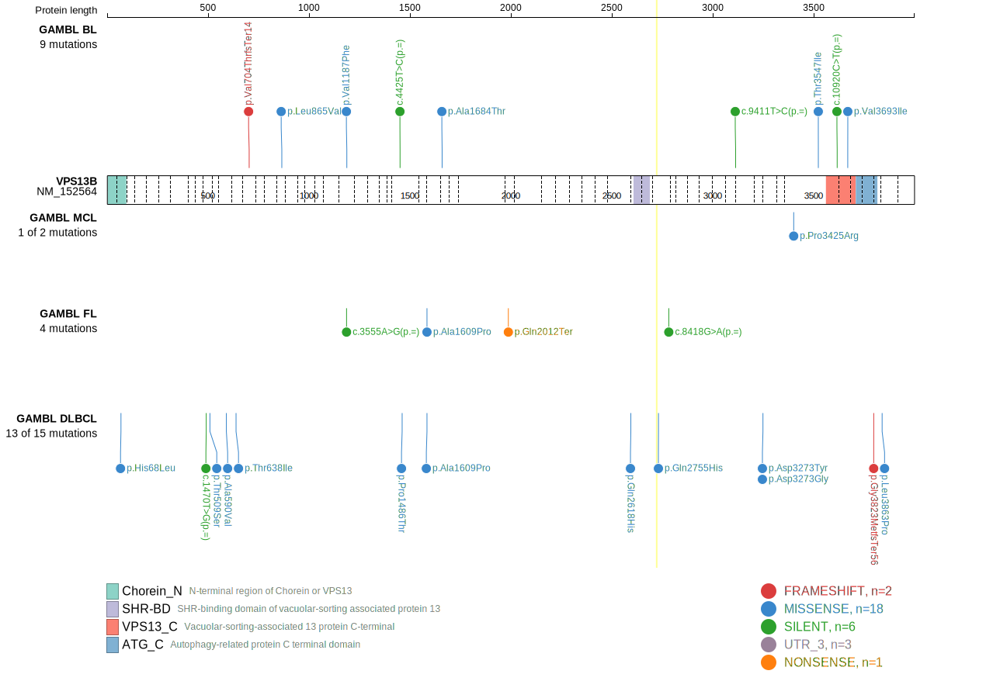
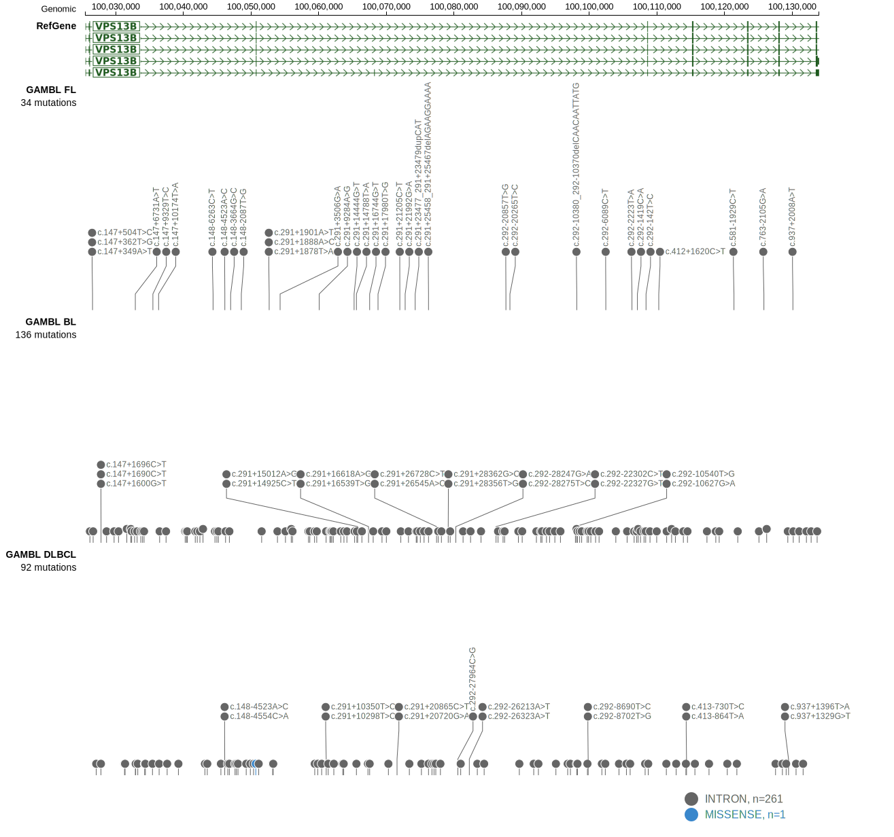
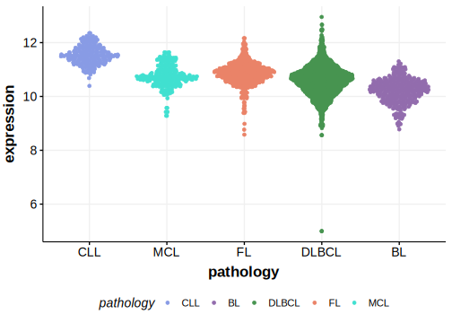

# VPS13B

## Relevance tier by entity

|Entity|Tier|Description               |
|:------:|:----:|--------------------------|
| |1   |high-confidence DLBCL gene|

## Mutation incidence in large patient cohorts (GAMBL reanalysis)

|Entity|source        |frequency (%)|
|:------:|:--------------:|:-------------:|
|DLBCL |GAMBL genomes |4.21         |
|DLBCL |Schmitz cohort|8.30         |
|DLBCL |Reddy cohort  |5.71         |
|DLBCL |Chapuy cohort |4.27         |

## Mutation pattern and selective pressure estimates

|Entity|aSHM|Significant selection|dN/dS (missense)|dN/dS (nonsense)|
|:------:|:----:|:---------------------:|:----------------:|:----------------:|
|BL    |No  |No                   |0.768           |0.000           |
|DLBCL |No  |No                   |1.730           |0.000           |
|FL    |No  |No                   |0.000           |4.014           |

 ## VPS13B Hotspots

| Chromosome |Coordinate (hg19) | ref>alt | HGVSp | 
 | :---:| :---: | :--: | :---: |
| chr8 | 100829860 | A>T | Q2755H |

View coding variants in ProteinPaint [hg19](https://morinlab.github.io/LLMPP/GAMBL/VPS13B_protein.html)  or [hg38](https://morinlab.github.io/LLMPP/GAMBL/VPS13B_protein_hg38.html)

View all variants in GenomePaint [hg19](https://morinlab.github.io/LLMPP/GAMBL/VPS13B.html)  or [hg38](https://morinlab.github.io/LLMPP/GAMBL/VPS13B_hg38.html)

## VPS13B Expression

<!-- ORIGIN: Unknown -->
