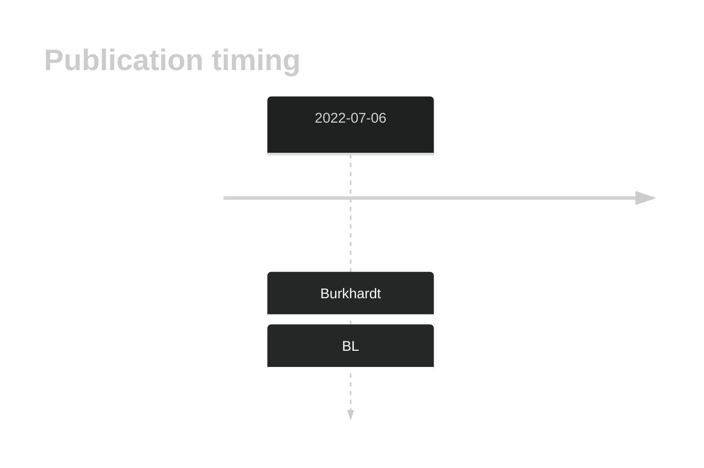
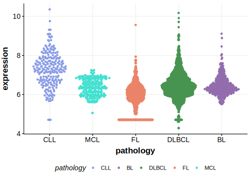

# VWA7
## History

## Relevance tier by entity

|Entity|Tier|Description                           |
|:------:|:----:|--------------------------------------|
|    |2   |relevance in BL not firmly established|

## Mutation incidence in large patient cohorts (GAMBL reanalysis)

|Entity|source               |frequency (%)|
|:------:|:---------------------:|:-------------:|
|BL    |GAMBL genomes+capture|1.85         |
|BL    |Thomas cohort        |  NA         |
|BL    |Panea cohort         |  NA         |

## Mutation pattern and selective pressure estimates

|Entity|aSHM|Significant selection|dN/dS (missense)|dN/dS (nonsense)|
|:------:|:----:|:---------------------:|:----------------:|:----------------:|
|BL    |No  |No                   |1.954           |0               |
|DLBCL |No  |No                   |1.059           |0               |
|FL    |No  |No                   |1.950           |0               |

> [!NOTE]
> First described in BL in 2022 by [Burkhardt B](https://pubmed.ncbi.nlm.nih.gov/35794096)

View coding variants in ProteinPaint [hg19](https://morinlab.github.io/LLMPP/GAMBL/VWA7_protein.html)  or [hg38](https://morinlab.github.io/LLMPP/GAMBL/VWA7_protein_hg38.html)

View all variants in GenomePaint [hg19](https://morinlab.github.io/LLMPP/GAMBL/VWA7.html)  or [hg38](https://morinlab.github.io/LLMPP/GAMBL/VWA7_hg38.html)

## VWA7 Expression

<!-- ORIGIN: burkhardtClinicalRelevanceMolecular2022b -->
<!-- BL: burkhardtClinicalRelevanceMolecular2022b -->
## References
1.  Burkhardt B, Michgehl U, Rohde J, Erdmann T, Berning P, Reutter K, Rohde M, Borkhardt A, Burmeister T, Dave S, Tzankov A, Dugas M, Sandmann S, Fend F, Finger J, Mueller S, Gökbuget N, Haferlach T, Kern W, Hartmann W, Klapper W, Oschlies I, Richter J, Kontny U, Lutz M, Maecker-Kolhoff B, Ott G, Rosenwald A, Siebert R, von Stackelberg A, Strahm B, Woessmann W, Zimmermann M, Zapukhlyak M, Grau M, Lenz G. Clinical relevance of molecular characteristics in Burkitt lymphoma differs according to age. Nat Commun. 2022 Jul 6;13(1):3881. PMCID: PMC9259584
