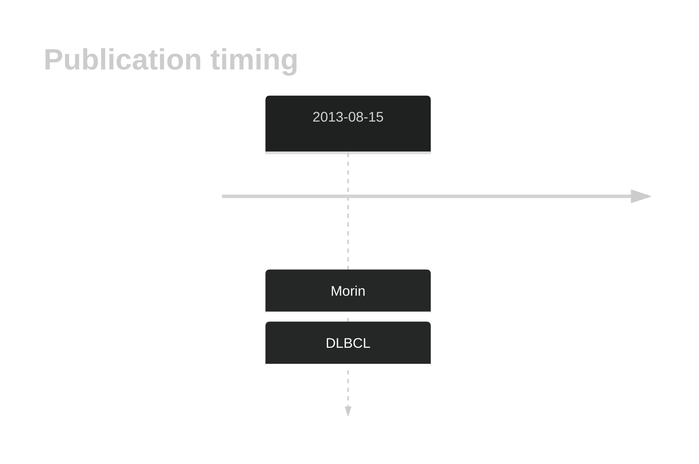
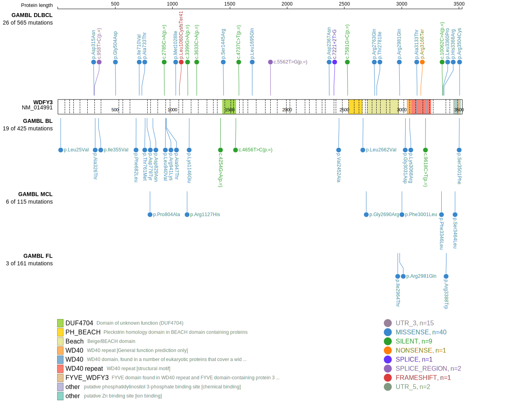
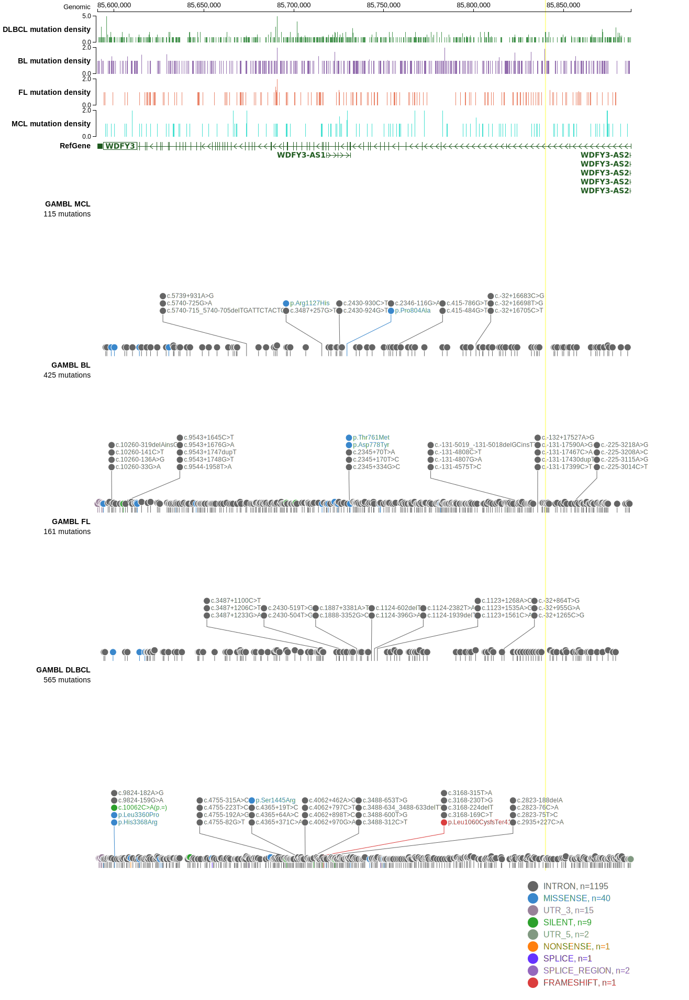
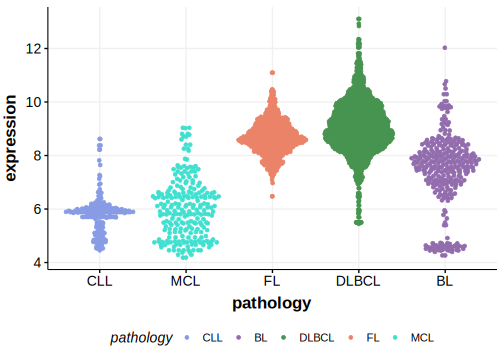

# WDFY3

## History

## Relevance tier by entity

|Entity|Tier|Description                              |
|:------:|:----:|-----------------------------------------|
| |2   |relevance in DLBCL not firmly established[@morinMutationalStructuralAnalysis2013]|

## Mutation incidence in large patient cohorts (GAMBL reanalysis)

|Entity|source        |frequency (%)|
|:------:|:--------------:|:-------------:|
|DLBCL |GAMBL genomes |4.21         |
|DLBCL |Schmitz cohort|8.30         |
|DLBCL |Reddy cohort  |4.70         |
|DLBCL |Chapuy cohort |7.26         |

## Mutation pattern and selective pressure estimates

|Entity|aSHM|Significant selection|dN/dS (missense)|dN/dS (nonsense)|
|:------:|:----:|:---------------------:|:----------------:|:----------------:|
|BL    |No  |No                   |2.696           |0.000           |
|DLBCL |No  |No                   |1.207           |3.494           |
|FL    |No  |No                   |2.069           |0.000           |

View coding variants in ProteinPaint [hg19](https://morinlab.github.io/LLMPP/GAMBL/WDFY3_protein.html)  or [hg38](https://morinlab.github.io/LLMPP/GAMBL/WDFY3_protein_hg38.html)

View all variants in GenomePaint [hg19](https://morinlab.github.io/LLMPP/GAMBL/WDFY3.html)  or [hg38](https://morinlab.github.io/LLMPP/GAMBL/WDFY3_hg38.html)

## WDFY3 Expression

<!-- ORIGIN: morinMutationalStructuralAnalysis2013 -->
<!-- DLBCL: morinMutationalStructuralAnalysis2013 -->

## All Mutations

[RG003](https://www.bcgsc.ca/downloads/morinlab/GAMBL/Morin_2013/RG003.html)
[RG027](https://www.bcgsc.ca/downloads/morinlab/GAMBL/Morin_2013/RG027.html)
[RG064](https://www.bcgsc.ca/downloads/morinlab/GAMBL/Morin_2013/RG064.html)
[RG067](https://www.bcgsc.ca/downloads/morinlab/GAMBL/Morin_2013/RG067.html)
[RG083](https://www.bcgsc.ca/downloads/morinlab/GAMBL/Morin_2013/RG083.html)

## References
