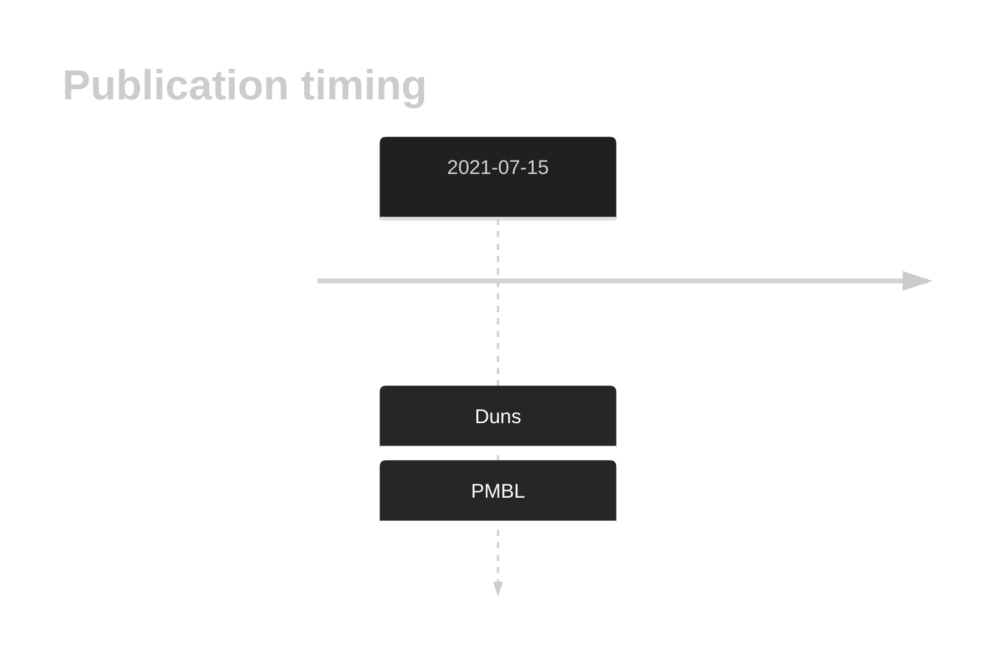

# WDR87

## History

## Relevance tier by entity

|Entity|Tier|Description|
|:------:|:----:|--------------------------------------|
||2|relevance in PMBL/cHL/GZL not firmly established[@dunsCharacterizationDLBCLPMBL2021b]|

## Mutation incidence in large patient cohorts (GAMBL reanalysis)

|Entity|source |frequency (%)|
|:------:|:----:|:----:|
|BL|GAMBL Exome |4.598 |
|BL|GAMBL Genome |2.317 |
|DLBCL|GAMBL Exome |3.935 |
|DLBCL|GAMBL Genome |3.195 |
|FL|GAMBL Exome |0.287 |

## References

