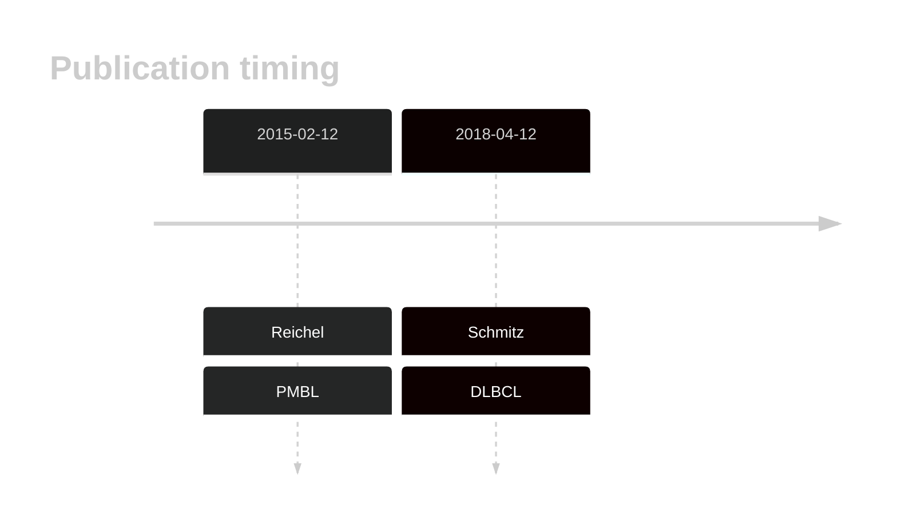
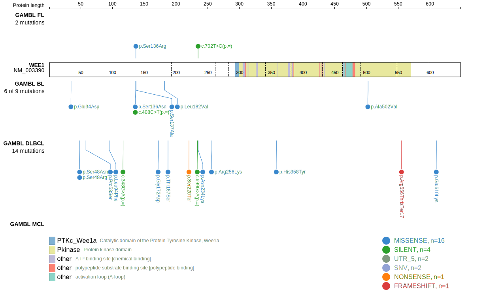
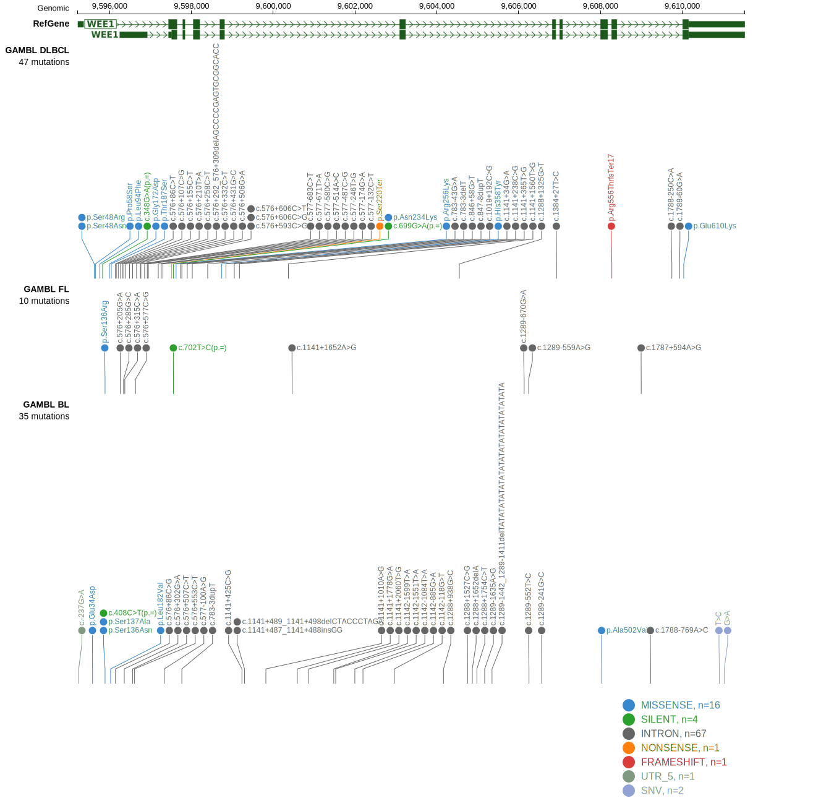
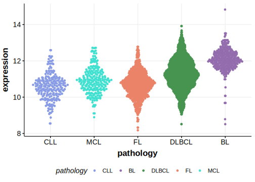

# WEE1

## Overview
WEE1 is one of [a number of genes](https://github.com/morinlab/LLMPP/wiki/ashm) affected by aberrant somatic hypermutation in B-cell lymphomas, which complicates the interpretation of mutations at this locus. 

## History

## Relevance tier by entity

|Entity|Tier|Description               |
|:------:|:----:|--------------------------|
||1|high-confidence PMBL/cHL/GZL gene|
| |1-a | aSHM target and high-confidence DLBCL gene|

## Mutation incidence in large patient cohorts (GAMBL reanalysis)

|Entity|source        |frequency (%)|
|:------:|:--------------:|:-------------:|
|DLBCL |GAMBL genomes |4.02         |
|DLBCL |Schmitz cohort|2.77         |
|DLBCL |Reddy cohort  |1.60         |
|DLBCL |Chapuy cohort |1.71         |

## Mutation pattern and selective pressure estimates

|Entity|aSHM|Significant selection|dN/dS (missense)|dN/dS (nonsense)|
|:------:|:----:|:---------------------:|:----------------:|:----------------:|
|BL    |Yes |No                   |4.336           | 0.000          |
|DLBCL |Yes |Yes                  |8.073           |15.059          |
|FL    |Yes |No                   |4.041           | 0.000          |

## aSHM regions

|chr_name|hg19_start|hg19_end|region                                                                                     |regulatory_comment|
|:--------:|:----------:|:--------:|:-------------------------------------------------------------------------------------------:|:------------------:|
|chr11   |9595246   |9599502 |[intron](https://genome.ucsc.edu/s/rdmorin/GAMBL%20hg19?position=chr11%3A9595246%2D9599502)|NA                |

## WEE1 Hotspots

| Chromosome |Coordinate (hg19) | ref>alt | HGVSp | 
 | :---:| :---: | :--: | :---: |
| chr11 | 9595762 | G>C | L94F |
| chr11 | 9595887 | G>A | S136N |
| chr11 | 9595888 | C>G | S136R |
| chr11 | 9595889 | T>G | S137A |

View coding variants in ProteinPaint [hg19](https://morinlab.github.io/LLMPP/GAMBL/WEE1_protein.html)  or [hg38](https://morinlab.github.io/LLMPP/GAMBL/WEE1_protein_hg38.html)

View all variants in GenomePaint [hg19](https://morinlab.github.io/LLMPP/GAMBL/WEE1.html)  or [hg38](https://morinlab.github.io/LLMPP/GAMBL/WEE1_hg38.html)

## WEE1 Expression

<!-- ORIGIN: reichelFlowSortingExome2015a -->
<!-- PMBL: reichelFlowSortingExome2015a -->
<!-- DLBCL: schmitzGeneticsPathogenesisDiffuse2018a -->

## References
1.  Reichel J, Chadburn A, Rubinstein PG, Giulino-Roth L, Tam W, Liu Y, Gaiolla R, Eng K, Brody J, Inghirami G, Carlo-Stella C, Santoro A, Rahal D, Totonchy J, Elemento O, Cesarman E, Roshal M. Flow sorting and exome sequencing reveal the oncogenome of primary Hodgkin and Reed-Sternberg cells. Blood. 2015 Feb 12;125(7):1061–1072. PMID: 25488972
2.  Schmitz R, Wright GW, Huang DW, Johnson CA, Phelan JD, Wang JQ, Roulland S, Kasbekar M, Young RM, Shaffer AL, Hodson DJ, Xiao W, Yu X, Yang Y, Zhao H, Xu W, Liu X, Zhou B, Du W, Chan WC, Jaffe ES, Gascoyne RD, Connors JM, Campo E, Lopez-Guillermo A, Rosenwald A, Ott G, Delabie J, Rimsza LM, Tay Kuang Wei K, Zelenetz AD, Leonard JP, Bartlett NL, Tran B, Shetty J, Zhao Y, Soppet DR, Pittaluga S, Wilson WH, Staudt LM. Genetics and Pathogenesis of Diffuse Large B-Cell Lymphoma. N Engl J Med. 2018 Apr 12;378(15):1396–1407. PMCID: PMC6010183
