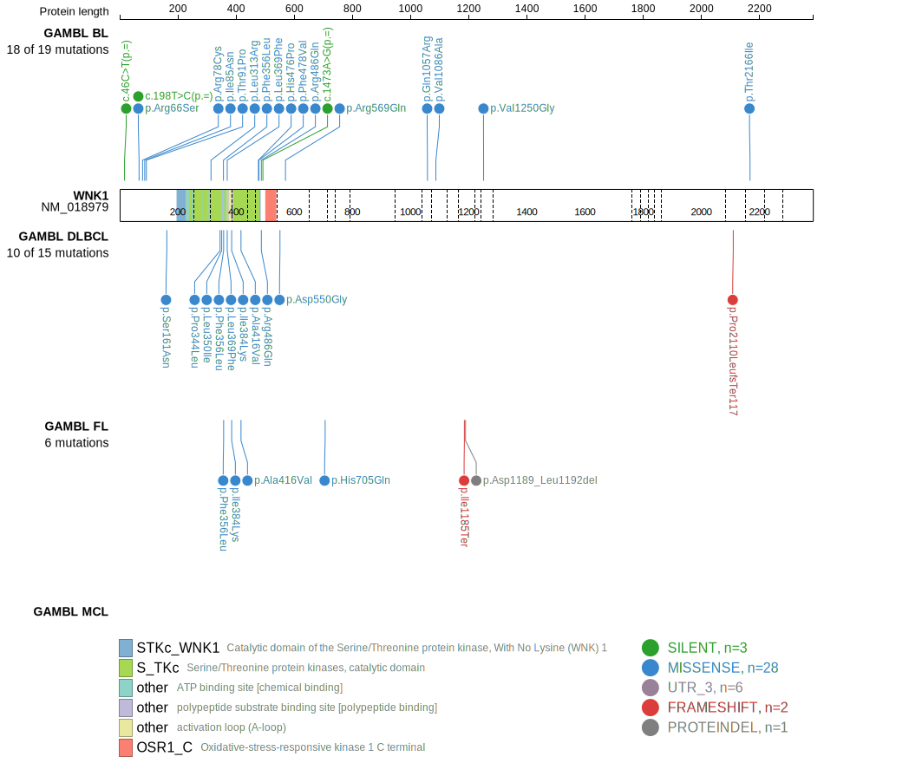
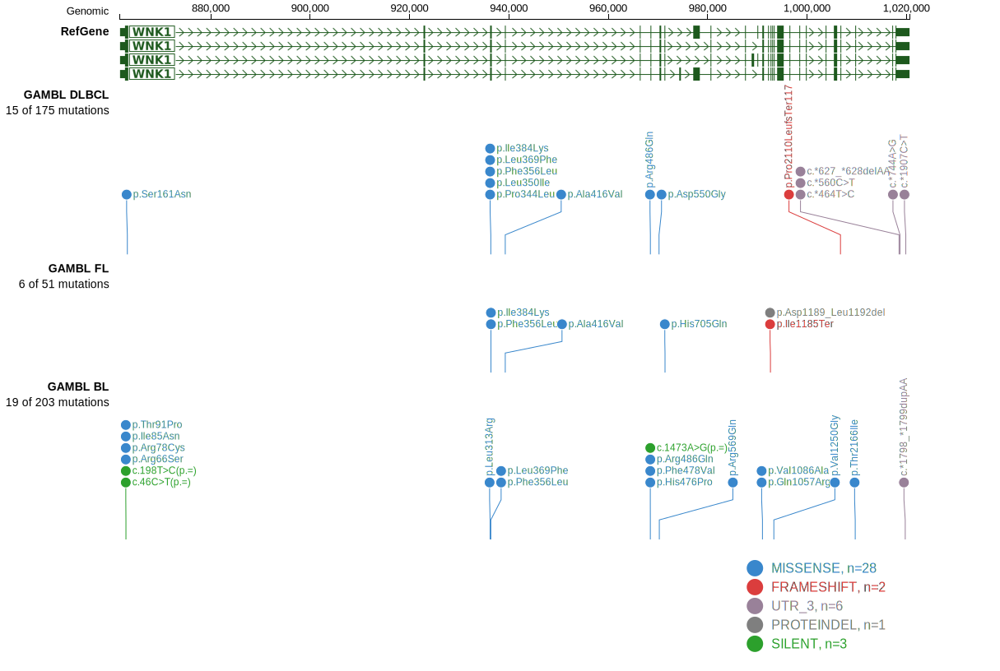

# [WNK1]

## Mutation tier

|Entity|Tier|Description                              |
|:------:|:----:|-----------------------------------------|
|BL    |1   |high-confidence BL gene                  |
|DLBCL |2   |relevance in DLBCL not firmly established|
## Mutation incidence

|Entity|source               |frequency (%)|
|:------:|:---------------------:|:-------------:|
|BL    |GAMBL genomes+capture| 6.70        |
|BL    |Thomas cohort        | 6.80        |
|BL    |Panea cohort         |11.90        |
|DLBCL |GAMBL genomes        | 4.59        |
|DLBCL |Schmitz cohort       | 5.11        |
|DLBCL |Reddy cohort         | 3.70        |
|DLBCL |Chapuy cohort        | 2.14        |

## Mutation pattern

|Entity|aSHM|Significant selection|dN/dS (missense)|dN/dS (nonsense)|
|:------:|:----:|:---------------------:|:----------------:|:----------------:|
|BL    |No  |No                   |3.429           |0               |
|DLBCL |No  |No                   |1.812           |0               |
|FL    |No  |No                   |3.487           |0               |

> [!NOTE]
> First described in BL in 2023 by [Thomas N](https://pubmed.ncbi.nlm.nih.gov/36201743). First described in DLBCL in 2021 by [Hübschmann D](https://pubmed.ncbi.nlm.nih.gov/33953289)

 ## WNK1 Hotspots

| Chromosome |Coordinate (hg19) | ref>alt | HGVSp | 
 | :---:| :---: | :--: | :---: |
| chr12 | 968467 | G>A | R486Q |

View coding variants in ProteinPaint [hg19](https://www.bcgsc.ca/downloads/morinlab/GAMBL/test/genes/WNK1_protein.html)  or [hg38](https://www.bcgsc.ca/downloads/morinlab/GAMBL/test/genes/WNK1_protein_hg38.html)

View all variants in GenomePaint [hg19](https://www.bcgsc.ca/downloads/morinlab/GAMBL/test/genes/WNK1.html)  or [hg38](https://www.bcgsc.ca/downloads/morinlab/GAMBL/test/genes/WNK1_hg38.html)

