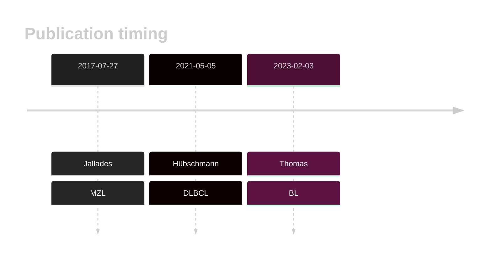

# WNK1

## History

## Relevance tier by entity

|Entity|Tier|Description                              |
|:------:|:----:|-----------------------------------------|
||2|relevance in MZL not firmly established[@jalladesExomeSequencingIdentifies2017]|
|    |1   |high-confidence BL gene                  [@thomasGeneticSubgroupsInform2023]|
| |2   |relevance in DLBCL not firmly established[@hubschmannMutationalMechanismsShaping2021b]|

## Mutation incidence in large patient cohorts (GAMBL reanalysis)

|Entity|source               |frequency (%)|
|:------:|:---------------------:|:-------------:|
|BL    |GAMBL genomes+capture| 6.70        |
|BL    |Thomas cohort        | 6.80        |
|BL    |Panea cohort         |11.90        |
|DLBCL |GAMBL genomes        | 4.59        |
|DLBCL |Schmitz cohort       | 5.11        |
|DLBCL |Reddy cohort         | 3.70        |
|DLBCL |Chapuy cohort        | 2.14        |

## Mutation pattern and selective pressure estimates

|Entity|aSHM|Significant selection|dN/dS (missense)|dN/dS (nonsense)|
|:------:|:----:|:---------------------:|:----------------:|:----------------:|
|BL    |No  |No                   |3.429           |0               |
|DLBCL |No  |No                   |1.812           |0               |
|FL    |No  |No                   |3.487           |0               |

## WNK1 Hotspots

| Chromosome |Coordinate (hg19) | ref>alt | HGVSp | 
 | :---:| :---: | :--: | :---: |
| chr12 | 968467 | G>A | R486Q |

View coding variants in ProteinPaint [hg19](https://morinlab.github.io/LLMPP/GAMBL/WNK1_protein.html)  or [hg38](https://morinlab.github.io/LLMPP/GAMBL/WNK1_protein_hg38.html)

View all variants in GenomePaint [hg19](https://morinlab.github.io/LLMPP/GAMBL/WNK1.html)  or [hg38](https://morinlab.github.io/LLMPP/GAMBL/WNK1_hg38.html)

## WNK1 Expression

<!-- ORIGIN: jalladesExomeSequencingIdentifies2017 -->
<!-- DLBCL: hubschmannMutationalMechanismsShaping2021b -->
<!-- MZL: jalladesExomeSequencingIdentifies2017 -->
<!-- BL: thomasGeneticSubgroupsInform2023 -->

## All Mutations

### DLBCL2

[SP192988](https://www.bcgsc.ca/downloads/morinlab/GAMBL/MALY/SP192988.html)
[SP193025](https://www.bcgsc.ca/downloads/morinlab/GAMBL/MALY/SP193025.html)
[SP193684](https://www.bcgsc.ca/downloads/morinlab/GAMBL/MALY/SP193684.html)
[SP194228](https://www.bcgsc.ca/downloads/morinlab/GAMBL/MALY/SP194228.html)
[SP59344](https://www.bcgsc.ca/downloads/morinlab/GAMBL/MALY/SP59344.html)
[SP59452](https://www.bcgsc.ca/downloads/morinlab/GAMBL/MALY/SP59452.html)

## References
