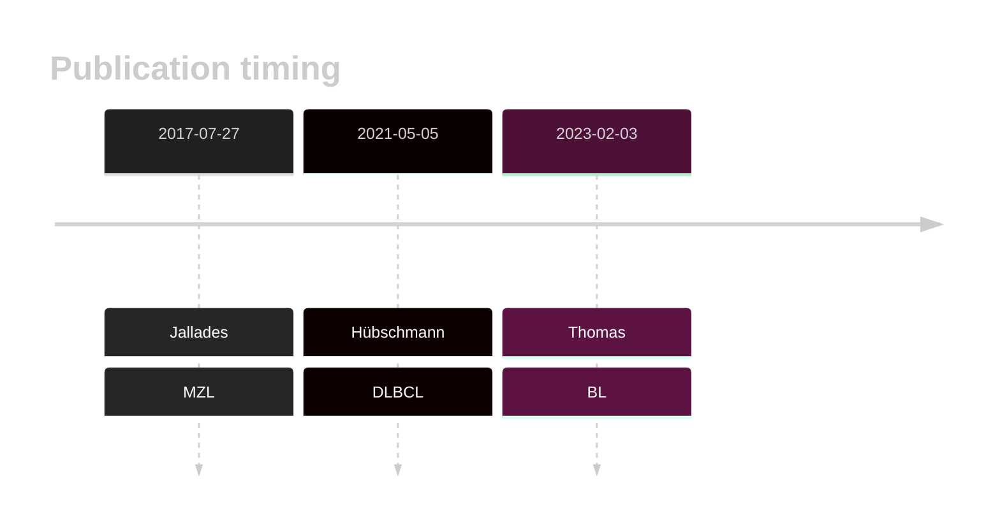

# WNK1

## History

## Relevance tier by entity

|Entity|Tier|Description                              |
|:------:|:----:|-----------------------------------------|
||2|relevance in MZL not firmly established|
|    |1   |high-confidence BL gene                  |
| |2   |relevance in DLBCL not firmly established|

## Mutation incidence in large patient cohorts (GAMBL reanalysis)

|Entity|source               |frequency (%)|
|:------:|:---------------------:|:-------------:|
|BL    |GAMBL genomes+capture| 6.70        |
|BL    |Thomas cohort        | 6.80        |
|BL    |Panea cohort         |11.90        |
|DLBCL |GAMBL genomes        | 4.59        |
|DLBCL |Schmitz cohort       | 5.11        |
|DLBCL |Reddy cohort         | 3.70        |
|DLBCL |Chapuy cohort        | 2.14        |

## Mutation pattern and selective pressure estimates

|Entity|aSHM|Significant selection|dN/dS (missense)|dN/dS (nonsense)|
|:------:|:----:|:---------------------:|:----------------:|:----------------:|
|BL    |No  |No                   |3.429           |0               |
|DLBCL |No  |No                   |1.812           |0               |
|FL    |No  |No                   |3.487           |0               |

## WNK1 Hotspots

| Chromosome |Coordinate (hg19) | ref>alt | HGVSp | 
 | :---:| :---: | :--: | :---: |
| chr12 | 968467 | G>A | R486Q |

View coding variants in ProteinPaint [hg19](https://morinlab.github.io/LLMPP/GAMBL/WNK1_protein.html)  or [hg38](https://morinlab.github.io/LLMPP/GAMBL/WNK1_protein_hg38.html)

View all variants in GenomePaint [hg19](https://morinlab.github.io/LLMPP/GAMBL/WNK1.html)  or [hg38](https://morinlab.github.io/LLMPP/GAMBL/WNK1_hg38.html)

## WNK1 Expression

<!-- ORIGIN: jalladesExomeSequencingIdentifies2017 -->
<!-- DLBCL: hubschmannMutationalMechanismsShaping2021b -->
<!-- MZL: jalladesExomeSequencingIdentifies2017 -->
<!-- BL: thomasGeneticSubgroupsInform2023 -->

## All Mutations

### DLBCL2

[SP192988](https://www.bcgsc.ca/downloads/morinlab/GAMBL/MALY/SP192988.html)
[SP193025](https://www.bcgsc.ca/downloads/morinlab/GAMBL/MALY/SP193025.html)
[SP193684](https://www.bcgsc.ca/downloads/morinlab/GAMBL/MALY/SP193684.html)
[SP194228](https://www.bcgsc.ca/downloads/morinlab/GAMBL/MALY/SP194228.html)
[SP59344](https://www.bcgsc.ca/downloads/morinlab/GAMBL/MALY/SP59344.html)
[SP59452](https://www.bcgsc.ca/downloads/morinlab/GAMBL/MALY/SP59452.html)

## References
1.  Jallades L, Baseggio L, Sujobert P, Huet S, Chabane K, Callet-Bauchu E, Verney A, Hayette S, Desvignes JP, Salgado D, Levy N, Béroud C, Felman P, Berger F, Magaud JP, Genestier L, Salles G, Traverse-Glehen A. Exome sequencing identifies recurrent BCOR alterations and the absence of KLF2, TNFAIP3 and MYD88 mutations in splenic diffuse red pulp small B-cell lymphoma. Haematologica. 2017 Oct;102(10):1758–1766. PMCID: PMC5622860
2.  Hübschmann D, Kleinheinz K, Wagener R, Bernhart SH, López C, Toprak UH, Sungalee S, Ishaque N, Kretzmer H, Kreuz M, Waszak SM, Paramasivam N, Ammerpohl O, Aukema SM, Beekman R, Bergmann AK, Bieg M, Binder H, Borkhardt A, Borst C, Brors B, Bruns P, Carrillo de Santa Pau E, Claviez A, Doose G, Haake A, Karsch D, Haas S, Hansmann ML, Hoell JI, Hovestadt V, Huang B, Hummel M, Jäger-Schmidt C, Kerssemakers JNA, Korbel JO, Kube D, Lawerenz C, Lenze D, Martens JHA, Ott G, Radlwimmer B, Reisinger E, Richter J, Rico D, Rosenstiel P, Rosenwald A, Schillhabel M, Stilgenbauer S, Stadler PF, Martín-Subero JI, Szczepanowski M, Warsow G, Weniger MA, Zapatka M, Valencia A, Stunnenberg HG, Lichter P, Möller P, Loeffler M, Eils R, Klapper W, Hoffmann S, Trümper L, ICGC MMML-Seq consortium, ICGC DE-Mining consortium, BLUEPRINT consortium, Küppers R, Schlesner M, Siebert R. Mutational mechanisms shaping the coding and noncoding genome of germinal center derived B-cell lymphomas. Leukemia. 2021 Jul;35(7):2002–2016. PMCID: PMC8257491
3.  Thomas N, Dreval K, Gerhard DS, Hilton LK, Abramson JS, Ambinder RF, Barta S, Bartlett NL, Bethony J, Bhatia K, Bowen J, Bryan AC, Cesarman E, Casper C, Chadburn A, Cruz M, Dittmer DP, Dyer MA, Farinha P, Gastier-Foster JM, Gerrie AS, Grande BM, Greiner T, Griner NB, Gross TG, Harris NL, Irvin JD, Jaffe ES, Henry D, Huppi R, Leal FE, Lee MS, Martin JP, Martin MR, Mbulaiteye SM, Mitsuyasu R, Morris V, Mullighan CG, Mungall AJ, Mungall K, Mutyaba I, Nokta M, Namirembe C, Noy A, Ogwang MD, Omoding A, Orem J, Ott G, Petrello H, Pittaluga S, Phelan JD, Ramos JC, Ratner L, Reynolds SJ, Rubinstein PG, Sissolak G, Slack G, Soudi S, Swerdlow SH, Traverse-Glehen A, Wilson WH, Wong J, Yarchoan R, ZenKlusen JC, Marra MA, Staudt LM, Scott DW, Morin RD. Genetic subgroups inform on pathobiology in adult and pediatric Burkitt lymphoma. Blood. 2023 Feb 23;141(8):904–916. 
