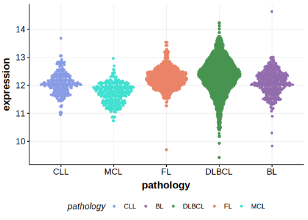

[[_TOC_]]

## Relevance tier by entity

|Entity|Tier|Description                              |
|:------:|:----:|-----------------------------------------|
||2|relevance in MZL not firmly established[@jalladesExomeSequencingIdentifies2017]|
|    |1   |high-confidence BL gene                  [@thomasGeneticSubgroupsInform2023]|
| |2   |relevance in DLBCL not firmly established[@hubschmannMutationalMechanismsShaping2021]|

## Mutation incidence in large patient cohorts (GAMBL reanalysis)

[[include:DLBCL_WNK1.md]]
[[include:BL_WNK1.md]]

## Mutation pattern and selective pressure estimates

[[include:dnds_WNK1.md]]

## WNK1 Hotspots

| Chromosome |Coordinate (hg19) | ref>alt | HGVSp | 
 | :---:| :---: | :--: | :---: |
| chr12 | 968467 | G>A | R486Q |

[[include:browser_WNK1.md]]

## Expression

<!-- ORIGIN: jalladesExomeSequencingIdentifies2017 -->
<!-- DLBCL: hubschmannMutationalMechanismsShaping2021b -->
<!-- MZL: jalladesExomeSequencingIdentifies2017 -->
<!-- BL: thomasGeneticSubgroupsInform2023 -->

## All Mutations

### DLBCL2

[SP192988](https://www.bcgsc.ca/downloads/morinlab/GAMBL/MALY/SP192988.html)
[SP193025](https://www.bcgsc.ca/downloads/morinlab/GAMBL/MALY/SP193025.html)
[SP193684](https://www.bcgsc.ca/downloads/morinlab/GAMBL/MALY/SP193684.html)
[SP194228](https://www.bcgsc.ca/downloads/morinlab/GAMBL/MALY/SP194228.html)
[SP59344](https://www.bcgsc.ca/downloads/morinlab/GAMBL/MALY/SP59344.html)
[SP59452](https://www.bcgsc.ca/downloads/morinlab/GAMBL/MALY/SP59452.html)

[[include:mermaid_WNK1.md]]

## References
