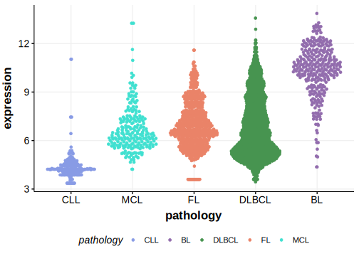

[[_TOC_]]

## Relevance tier by entity

[[include:table1_WNK2.md]]

## Mutation incidence in large patient cohorts (GAMBL reanalysis)

|Entity|source               |frequency (%)|
|:------:|:---------------------:|:-------------:|
|BL    |GAMBL genomes+capture| 3.23        |
|BL    |Thomas cohort        | 0.80        |
|BL    |Panea cohort         |10.90        |

## Mutation pattern and selective pressure estimates

[[include:dnds_WNK2.md]]

## WNK2 Hotspots

| Chromosome |Coordinate (hg19) | ref>alt | HGVSp | 
 | :---:| :---: | :--: | :---: |
| chr9 | 96031211 | G>A | A1375T |

[[include:browser_WNK2.md]]

## Expression

<!-- ORIGIN: paneaWholeGenomeLandscape2019 -->
<!-- BL: paneaWholeGenomeLandscape2019 -->

[[include:mermaid_WNK2.md]]

## References
