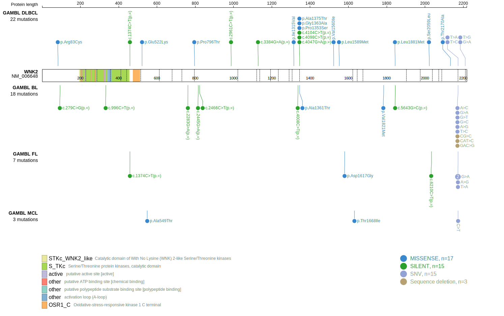
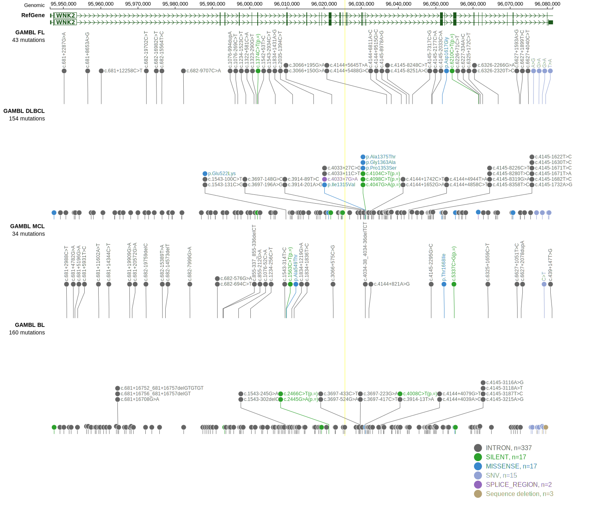

# WNK2

## Relevance tier by entity

|Entity|Tier|Description                           |
|:------:|:----:|--------------------------------------|
|BL    |2   |relevance in BL not firmly established|

## Mutation incidence in large patient cohorts (GAMBL reanalysis)

|Entity|source               |frequency (%)|
|:------:|:---------------------:|:-------------:|
|BL    |GAMBL genomes+capture| 3.23        |
|BL    |Thomas cohort        | 0.80        |
|BL    |Panea cohort         |10.90        |

## Mutation pattern and selective pressure estimates

|Entity|aSHM|Significant selection|dN/dS (missense)|dN/dS (nonsense)|
|:------:|:----:|:---------------------:|:----------------:|:----------------:|
|BL    |No  |No                   |0.309           |0               |
|DLBCL |No  |No                   |0.637           |0               |
|FL    |No  |No                   |0.000           |0               |

> [!NOTE]
> First described in BL in 2019 by [Panea RI](https://pubmed.ncbi.nlm.nih.gov/31558468)

 ## WNK2 Hotspots

| Chromosome |Coordinate (hg19) | ref>alt | HGVSp | 
 | :---:| :---: | :--: | :---: |
| chr9 | 96031211 | G>A | A1375T |

View coding variants in ProteinPaint [hg19](https://morinlab.github.io/LLMPP/GAMBL/WNK2_protein.html)  or [hg38](https://morinlab.github.io/LLMPP/GAMBL/WNK2_protein_hg38.html)

View all variants in GenomePaint [hg19](https://morinlab.github.io/LLMPP/GAMBL/WNK2.html)  or [hg38](https://morinlab.github.io/LLMPP/GAMBL/WNK2_hg38.html)

