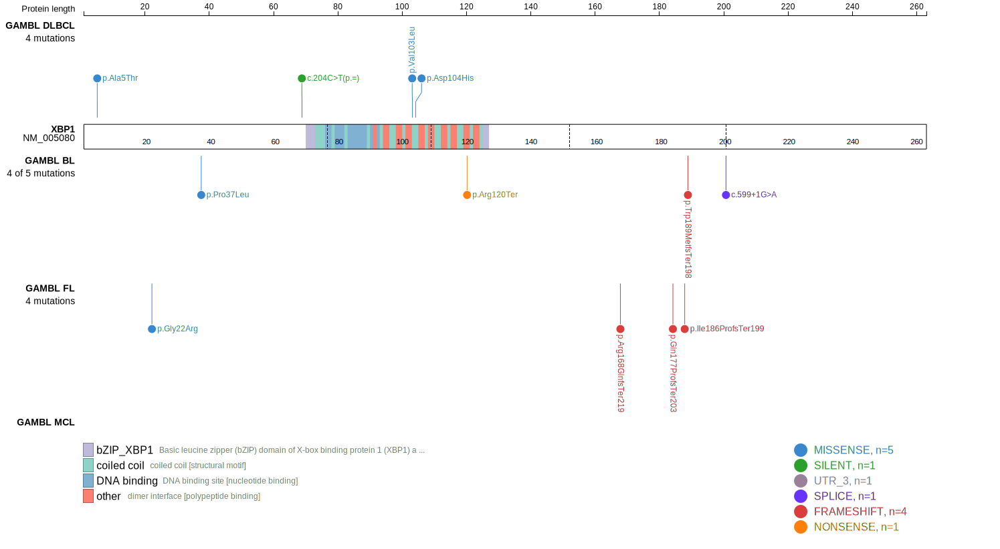
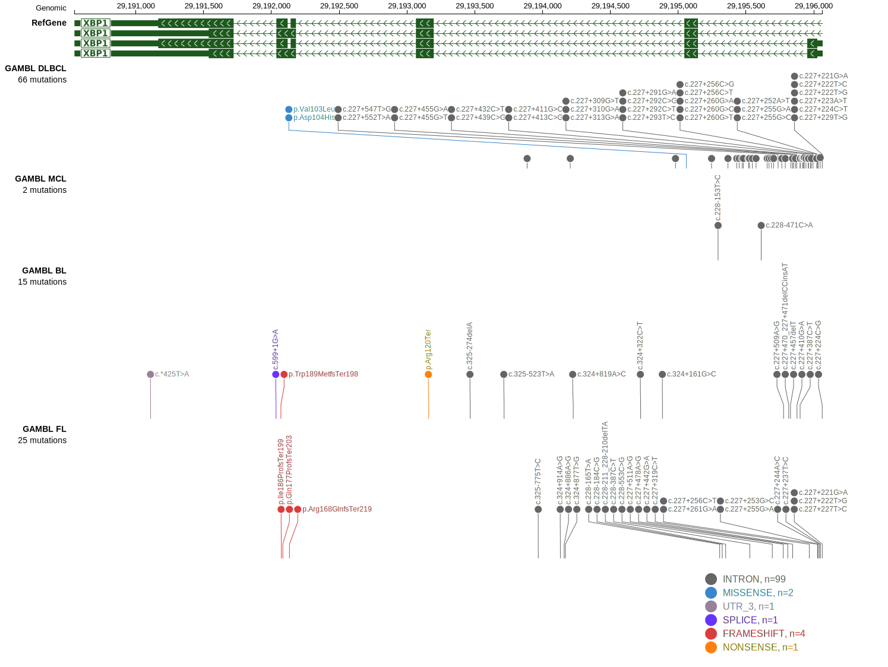
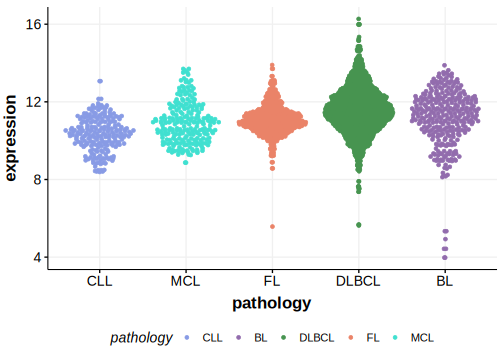

# XBP1

## Relevance tier by entity

|Entity|Tier|Description                              |
|:------:|:----:|-----------------------------------------|
|DLBCL |2-a | aSHM target; Although recurrent, the relevance of mutations in DLBCL is tenuous |

## Mutation incidence in large patient cohorts (GAMBL reanalysis)

|Entity|source        |frequency (%)|
|:------:|:--------------:|:-------------:|
|DLBCL |GAMBL genomes |1.15         |
|DLBCL |Schmitz cohort|1.28         |
|DLBCL |Reddy cohort  |1.60         |
|DLBCL |Chapuy cohort |  NA         |

## Mutation pattern and selective pressure estimates

|Entity|aSHM|Significant selection|dN/dS (missense)|dN/dS (nonsense)|
|:------:|:----:|:---------------------:|:----------------:|:----------------:|
|BL    |Yes |No                   |1.624           |39.881          |
|DLBCL |Yes |No                   |1.835           | 0.000          |
|FL    |Yes |No                   |2.607           | 0.000          |

## aSHM regions

|chr_name|hg19_start|hg19_end|region                                                                                    |regulatory_comment|
|:--------:|:----------:|:--------:|:------------------------------------------------------------------------------------------:|:------------------:|
|chr22   |29194943  |29197461|[TSS](https://genome.ucsc.edu/s/rdmorin/GAMBL%20hg19?position=chr22%3A29194943%2D29197461)|NA                |

View coding variants in ProteinPaint [hg19](https://morinlab.github.io/LLMPP/GAMBL/XBP1_protein.html)  or [hg38](https://morinlab.github.io/LLMPP/GAMBL/XBP1_protein_hg38.html)

View all variants in GenomePaint [hg19](https://morinlab.github.io/LLMPP/GAMBL/XBP1.html)  or [hg38](https://morinlab.github.io/LLMPP/GAMBL/XBP1_hg38.html)

## XBP1 Expression

<!-- FLAGGED FOR REMOVAL -->