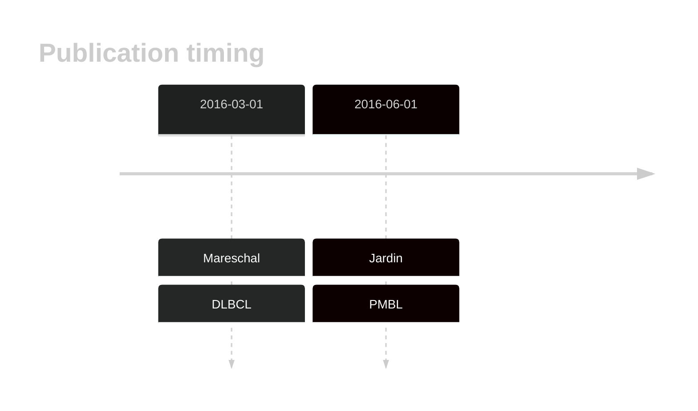

# XPO1
## History

## Relevance tier by entity

|Entity|Tier|Description               |
|:------:|:----:|--------------------------|
||1|high-confidence PMBL/cHL/GZL gene|
| |1   |high-confidence DLBCL gene|

## Mutation incidence in large patient cohorts (GAMBL reanalysis)

|Entity|source        |frequency (%)|
|:------:|:--------------:|:-------------:|
|DLBCL |GAMBL genomes |3.82         |
|DLBCL |Schmitz cohort|2.34         |
|DLBCL |Reddy cohort  |1.40         |
|DLBCL |Chapuy cohort |1.28         |

## Mutation pattern and selective pressure estimates

|Entity|aSHM|Significant selection|dN/dS (missense)|dN/dS (nonsense)|
|:------:|:----:|:---------------------:|:----------------:|:----------------:|
|BL    |No  |No                   |1.028           |0               |
|DLBCL |No  |No                   |9.927           |0               |
|FL    |No  |No                   |0.000           |0               |

 ## XPO1 Hotspots

| Chromosome |Coordinate (hg19) | ref>alt | HGVSp | 
 | :---:| :---: | :--: | :---: |
| chr2 | 61719471 | T>C | E571G |
| chr2 | 61719472 | C>T | E571K |

View coding variants in ProteinPaint [hg19](https://morinlab.github.io/LLMPP/GAMBL/XPO1_protein.html)  or [hg38](https://morinlab.github.io/LLMPP/GAMBL/XPO1_protein_hg38.html)

View all variants in GenomePaint [hg19](https://morinlab.github.io/LLMPP/GAMBL/XPO1.html)  or [hg38](https://morinlab.github.io/LLMPP/GAMBL/XPO1_hg38.html)

## XPO1 Expression

<!-- ORIGIN: mareschalWholeExomeSequencing2016 -->
<!-- DLBCL: mareschalWholeExomeSequencing2016 -->
<!-- PMBL: jardinRecurrentMutationsExportin2016a -->
## References
1.  Mareschal S, Dubois S, Viailly PJ, Bertrand P, Bohers E, Maingonnat C, Jaïs JP, Tesson B, Ruminy P, Peyrouze P, Copie-Bergman C, Fest T, Jo Molina T, Haioun C, Salles G, Tilly H, Lecroq T, Leroy K, Jardin F. Whole exome sequencing of relapsed/refractory patients expands the repertoire of somatic mutations in diffuse large B-cell lymphoma. Genes Chromosomes Cancer. 2016 Mar;55(3):251–267. PMID: 26608593
2.  Jardin F, Pujals A, Pelletier L, Bohers E, Camus V, Mareschal S, Dubois S, Sola B, Ochmann M, Lemonnier F, Viailly PJ, Bertrand P, Maingonnat C, Traverse-Glehen A, Gaulard P, Damotte D, Delarue R, Haioun C, Argueta C, Landesman Y, Salles G, Jais JP, Figeac M, Copie-Bergman C, Molina TJ, Picquenot JM, Cornic M, Fest T, Milpied N, Lemasle E, Stamatoullas A, Moeller P, Dyer MJS, Sundstrom C, Bastard C, Tilly H, Leroy K. Recurrent mutations of the exportin 1 gene (XPO1) and their impact on selective inhibitor of nuclear export compounds sensitivity in primary mediastinal B-cell lymphoma. Am J Hematol. 2016 Sep;91(9):923–930. PMID: 27312795
