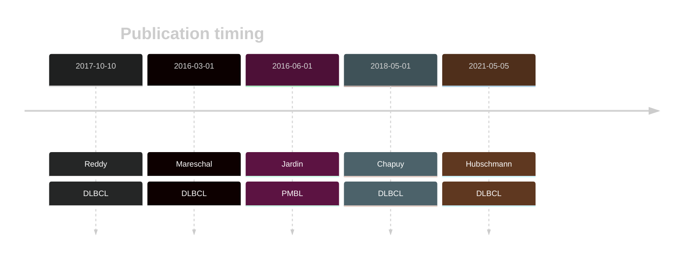
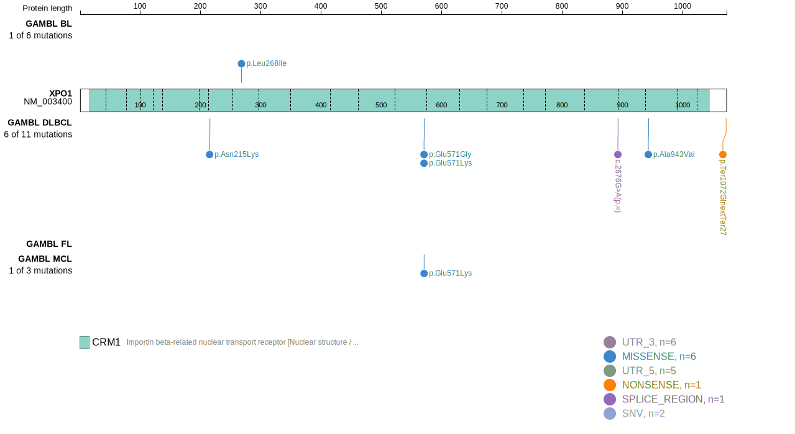
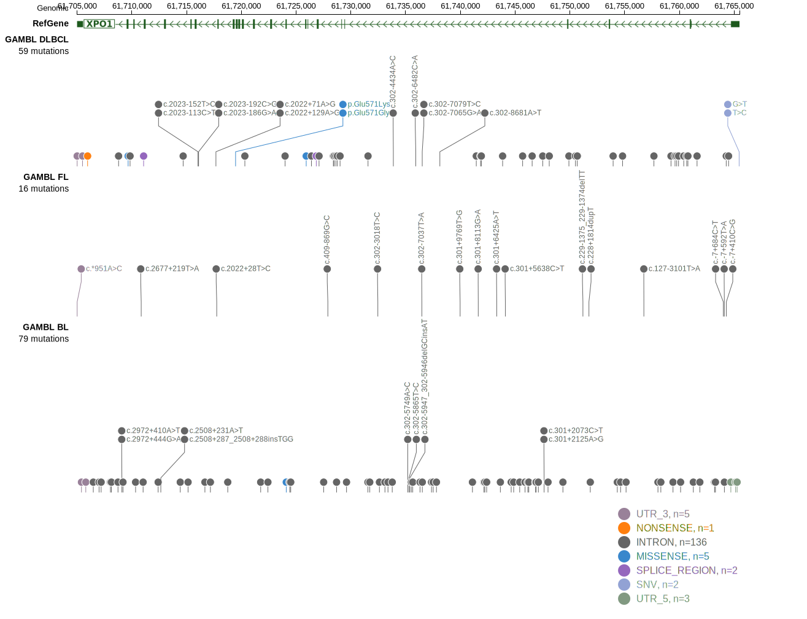
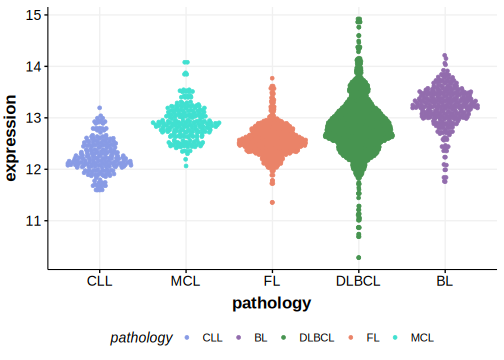

# XPO1

## History

## Relevance tier by entity

|Entity|Tier|Description               |
|:------:|:----:|--------------------------|
||1|high-confidence PMBL/cHL/GZL gene[@jardinRecurrentMutationsExportin2016]|
| |1   |high-confidence DLBCL gene[@mareschalWholeExomeSequencing2016; @reddyGeneticFunctionalDrivers2017]|

## Mutation incidence in large patient cohorts (GAMBL reanalysis)

|Entity|source        |frequency (%)|
|:------:|:--------------:|:-------------:|
|DLBCL |GAMBL genomes |3.82         |
|DLBCL |Schmitz cohort|2.34         |
|DLBCL |Reddy cohort  |1.40         |
|DLBCL |Chapuy cohort |1.28         |

## Mutation pattern and selective pressure estimates

|Entity|aSHM|Significant selection|dN/dS (missense)|dN/dS (nonsense)|
|:------:|:----:|:---------------------:|:----------------:|:----------------:|
|BL    |No  |No                   |1.028           |0               |
|DLBCL |No  |No                   |9.927           |0               |
|FL    |No  |No                   |0.000           |0               |

## XPO1 Hotspots

| Chromosome |Coordinate (hg19) | ref>alt | HGVSp | 
 | :---:| :---: | :--: | :---: |
| chr2 | 61719471 | T>C | E571G |
| chr2 | 61719472 | C>T | E571K |

View coding variants in ProteinPaint [hg19](https://morinlab.github.io/LLMPP/GAMBL/XPO1_protein.html)  or [hg38](https://morinlab.github.io/LLMPP/GAMBL/XPO1_protein_hg38.html)

View all variants in GenomePaint [hg19](https://morinlab.github.io/LLMPP/GAMBL/XPO1.html)  or [hg38](https://morinlab.github.io/LLMPP/GAMBL/XPO1_hg38.html)

## XPO1 Expression

<!-- ORIGIN: mareschalWholeExomeSequencing2016 -->
<!-- DLBCL: mareschalWholeExomeSequencing2016 -->
<!-- PMBL: jardinRecurrentMutationsExportin2016a -->

## References
