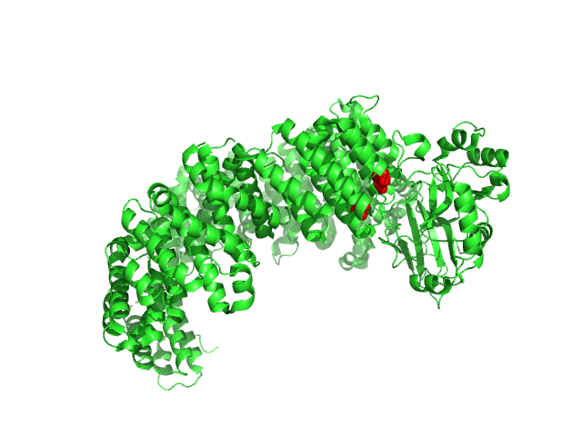
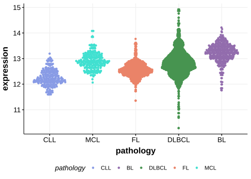

[[_TOC_]]

## Overview

XPO1 encodes exportin-1 (CRM1), a key nuclear export protein that regulates the cytoplasmic trafficking of many tumour suppressors and growth regulators, including TP53, RB, and FOXO family members[@balasubramanianSelectiveInhibitionNuclear2022]. In mature B-cell neoplasms, XPO1 is frequently overexpressed and recurrently mutated (most commonly E571K), particularly in primary mediastinal B-cell lymphoma, classical Hodgkin lymphoma, and subsets of DLBCL[@miloudiXPO1E571KMutationModifies2020; @camusXPO1CellHematological2017]. These alterations are thought to enhance nuclear export efficiency, functionally dampening tumour suppressor activity without requiring their genetic loss[@balasubramanianSelectiveInhibitionNuclear2022]. As a result, many B-cell lymphomas exhibit a shared dependency on XPO1-mediated nuclear export, providing a biologic rationale for XPO1 inhibition independent of mutation status.

## Experimental Evidence

In DLBCL, mutations at the canonical hotspot (E571) have been experimentally demonstrated to cause a new function (NEO).[@miloudiXPO1E571KMutationModifies2020] 

## Clinical Relevance

Selinexor (XPOVIO), an inhibitor of the nuclear export activity of XPO1 protein, has received [FDA approval](https://www.fda.gov/drugs/resources-information-approved-drugs/fda-approves-selinexor-relapsedrefractory-diffuse-large-b-cell-lymphoma?utm_source=chatgpt.com) *for adult patients with relapsed or refractory diffuse large B-cell lymphoma (DLBCL), not otherwise specified, including DLBCL arising from follicular lymphoma, after at least 2 lines of systemic therapy.* Importantly, eligibility does not depend on the presence of mutations in XPO1. 

## Relevance tier by entity

[[include:tables/table1_XPO1.md]]

## Mutation incidence in large patient cohorts (GAMBL reanalysis)

### DLBCL
[[include:tables/DLBCL_XPO1.md]]

## Mutation pattern and selective pressure estimates

[[include:tables/dnds_XPO1.md]]

## XPO1 Hotspots

| Chromosome |Coordinate (hg19) | ref>alt | HGVSp | 
 | :---:| :---: | :--: | :---: |
| chr2 | 61719471 | T>C | E571G |
| chr2 | 61719472 | C>T | E571K |

[[include:tables/browser_XPO1.md]]

## Expression

<!-- ORIGIN: mareschalWholeExomeSequencing2016 -->
<!-- DLBCL: mareschalWholeExomeSequencing2016 -->
<!-- PMBL: jardinRecurrentMutationsExportin2016a -->

[[include:tables/mermaid_XPO1.md]]

## References
