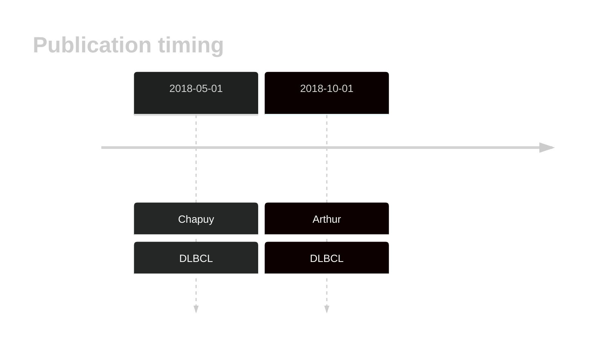

# ZC3H12A

## History

## Relevance tier by entity

|Entity|Tier|Description                           |
|:------:|:----:|--------------------------------------|
||2|relevance in MCL not firmly established|
| |1   |high-confidence DLBCL gene            [@chapuyMolecularSubtypesDiffuse2018b; @arthurGenomewideDiscoverySomatic2018]|
|    |2   |relevance in FL not firmly established|

## Mutation incidence in large patient cohorts (GAMBL reanalysis)

|Entity|source        |frequency (%)|
|:------:|:--------------:|:-------------:|
|DLBCL |GAMBL genomes |2.68         |
|DLBCL |Schmitz cohort|5.96         |
|DLBCL |Reddy cohort  |3.10         |
|DLBCL |Chapuy cohort |4.70         |
|FL    |GAMBL genomes |0.46         |

## Mutation pattern and selective pressure estimates

|Entity|aSHM|Significant selection|dN/dS (missense)|dN/dS (nonsense)|
|:------:|:----:|:---------------------:|:----------------:|:----------------:|
|BL    |No  |No                   |0.000           | 0.000          |
|DLBCL |No  |No                   |2.488           |18.944          |
|FL    |No  |No                   |0.000           | 0.000          |

View coding variants in ProteinPaint [hg19](https://morinlab.github.io/LLMPP/GAMBL/ZC3H12A_protein.html)  or [hg38](https://morinlab.github.io/LLMPP/GAMBL/ZC3H12A_protein_hg38.html)

View all variants in GenomePaint [hg19](https://morinlab.github.io/LLMPP/GAMBL/ZC3H12A.html)  or [hg38](https://morinlab.github.io/LLMPP/GAMBL/ZC3H12A_hg38.html)

## ZC3H12A Expression

<!-- ORIGIN: arthurGenomewideDiscoverySomatic2018 -->
<!-- DLBCL: arthurGenomewideDiscoverySomatic2018 -->

## References
