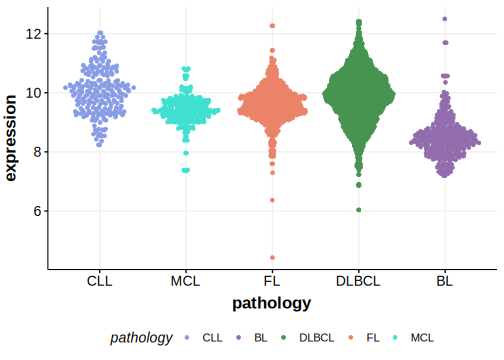

[[_TOC_]]

## Experimental Evidence

Driver mutations affecting this gene in DLBCL have been experimentally demonstrated to cause a reduction or loss of function (LOF).[@skalniakRegulatoryFeedbackLoop2009]

## Relevance tier by entity

[[include:tables/table1_ZC3H12A]]

## Mutation incidence in large patient cohorts (GAMBL reanalysis)

### DLBCL
[[include:tables/DLBCL_ZC3H12A.md]]

### FL
[[include:tables/FL_ZC3H12A.md]]

## Mutation pattern and selective pressure estimates

[[include:tables/dnds_ZC3H12A.md]]

[[include:tables/browser_ZC3H12A.md]]

## Expression

<!-- ORIGIN: arthurGenomewideDiscoverySomatic2018 -->
<!-- DLBCL: arthurGenomewideDiscoverySomatic2018 -->

[[include:tables/mermaid_ZC3H12A.md]]

## References
