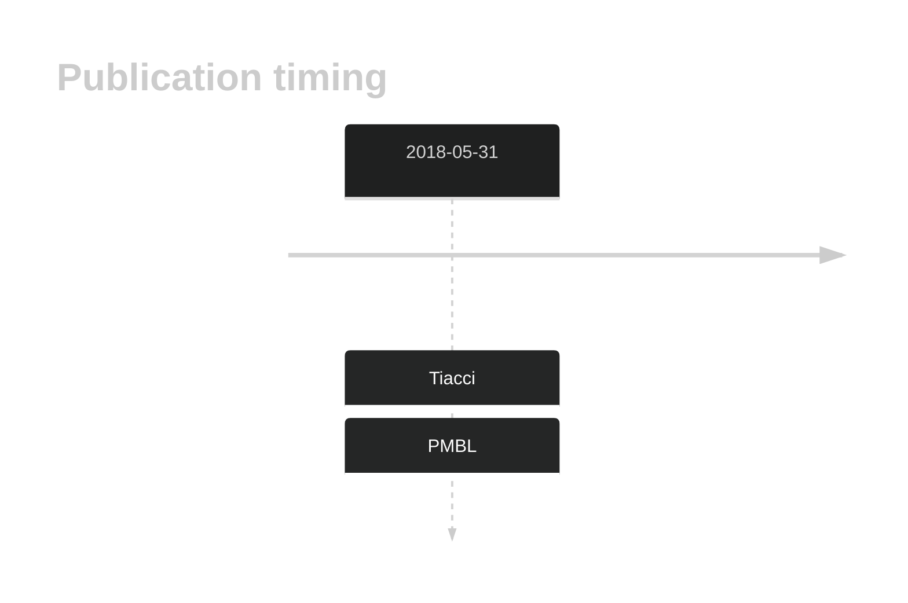

# ZCCHC11

## History

## Relevance tier by entity

|Entity|Tier|Description|
|:------:|:----:|--------------------------------------|
||2|relevance in PMBL/cHL/GZL not firmly established[@tiacciPervasiveMutationsJAKSTAT2018b]|

## Mutation incidence in large patient cohorts (GAMBL reanalysis)

|Entity|source |frequency (%)|
|:------:|:----:|:----:|
|BL|GAMBL Exome |2.874 |
|BL|GAMBL Genome |1.544 |
|DLBCL|GAMBL Exome |2.21 |
|DLBCL|GAMBL Genome |0.376 |
|FL|GAMBL Exome |0.287 |
|MCL|GAMBL Genome |1.17 |

## References

