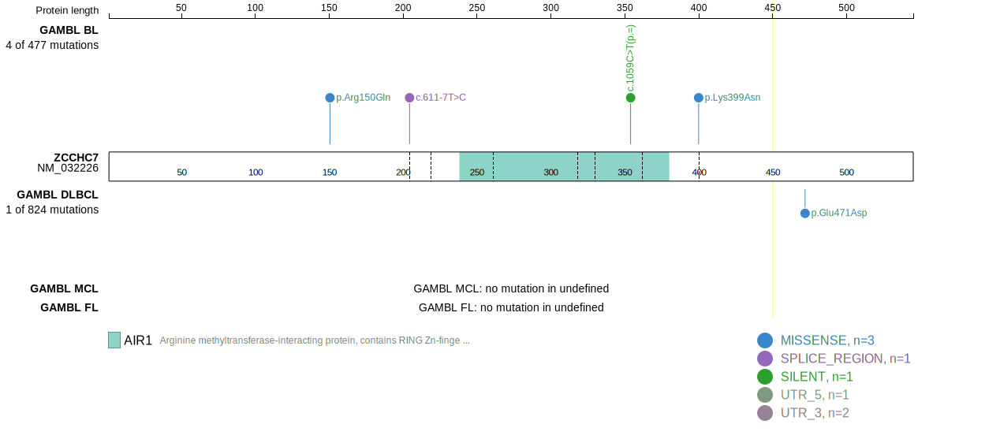
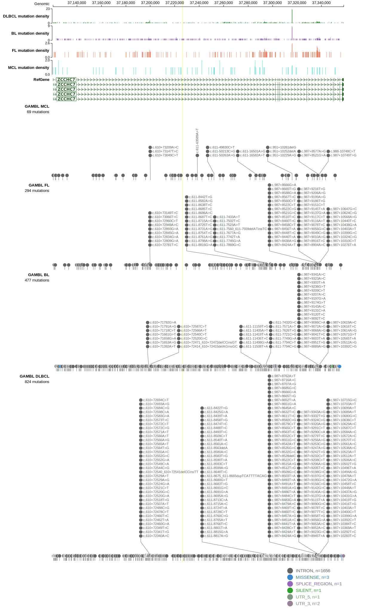

# ZCCHC7

## Relevance tier by entity

|Entity|Tier|Description                              |
|:------:|:----:|-----------------------------------------|
|DLBCL |2-a | aSHM target; Although recurrent, the relevance of mutations in DLBCL is tenuous |

## Mutation incidence in large patient cohorts (GAMBL reanalysis)

|Entity|source        |frequency (%)|
|:------:|:--------------:|:-------------:|
|DLBCL |GAMBL genomes |0.57         |
|DLBCL |Schmitz cohort|0.85         |
|DLBCL |Reddy cohort  |0.40         |
|DLBCL |Chapuy cohort |2.56         |

## Mutation pattern and selective pressure estimates

|Entity|aSHM|Significant selection|dN/dS (missense)|dN/dS (nonsense)|
|:------:|:----:|:---------------------:|:----------------:|:----------------:|
|BL    |Yes |No                   |2.124           |0               |
|DLBCL |Yes |No                   |1.558           |0               |
|FL    |Yes |No                   |0.000           |0               |

## aSHM regions

|chr_name|hg19_start|hg19_end|region                                                                                        |regulatory_comment|
|:--------:|:----------:|:--------:|:----------------------------------------------------------------------------------------------:|:------------------:|
|chr9    |37192080  |37207549|[intron-4](https://genome.ucsc.edu/s/rdmorin/GAMBL%20hg19?position=chr9%3A37192080%2D37207549)|intron            |
|chr9    |37275952  |37306152|[intron-2](https://genome.ucsc.edu/s/rdmorin/GAMBL%20hg19?position=chr9%3A37275952%2D37306152)|intron            |
|chr9    |37312655  |37328260|[intron-3](https://genome.ucsc.edu/s/rdmorin/GAMBL%20hg19?position=chr9%3A37312655%2D37328260)|intron            |
|chr9    |37329706  |37340398|[intron-1](https://genome.ucsc.edu/s/rdmorin/GAMBL%20hg19?position=chr9%3A37329706%2D37340398)|intron            |

> [!NOTE]
> First described in DLBCL in 2018 by [Arthur SE](https://pubmed.ncbi.nlm.nih.gov/30275490)

View coding variants in ProteinPaint [hg19](https://morinlab.github.io/LLMPP/GAMBL/ZCCHC7_protein.html)  or [hg38](https://morinlab.github.io/LLMPP/GAMBL/ZCCHC7_protein_hg38.html)

View all variants in GenomePaint [hg19](https://morinlab.github.io/LLMPP/GAMBL/ZCCHC7.html)  or [hg38](https://morinlab.github.io/LLMPP/GAMBL/ZCCHC7_hg38.html)

