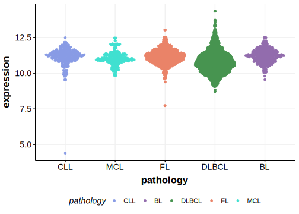

[[_TOC_]]

## Relevance tier by entity

[[include:table1_ZCCHC7]]

## Mutation incidence in large patient cohorts (GAMBL reanalysis)

### DLBCL
[[include:tables/DLBCL_ZCCHC7.md]]

## Mutation pattern and selective pressure estimates

[[include:tables/dnds_ZCCHC7.md]]

## aSHM regions

|chr_name|hg19_start|hg19_end|region                                                                                        |regulatory_comment|
|:--------:|:----------:|:--------:|:----------------------------------------------------------------------------------------------:|:------------------:|
|chr9    |37192080  |37207549|[intron-4](https://genome.ucsc.edu/s/rdmorin/GAMBL%20hg19?position=chr9%3A37192080%2D37207549)|intron            |
|chr9    |37275952  |37306152|[intron-2](https://genome.ucsc.edu/s/rdmorin/GAMBL%20hg19?position=chr9%3A37275952%2D37306152)|intron            |
|chr9    |37312655  |37328260|[intron-3](https://genome.ucsc.edu/s/rdmorin/GAMBL%20hg19?position=chr9%3A37312655%2D37328260)|intron            |
|chr9    |37329706  |37340398|[intron-1](https://genome.ucsc.edu/s/rdmorin/GAMBL%20hg19?position=chr9%3A37329706%2D37340398)|intron            |

[[include:browser_ZCCHC7.md]]

## Expression

<!-- ORIGIN: arthurGenomewideDiscoverySomatic2018 -->
<!-- DLBCL: arthurGenomewideDiscoverySomatic2018 -->

[[include:tables/mermaid_ZCCHC7.md]]

## References
