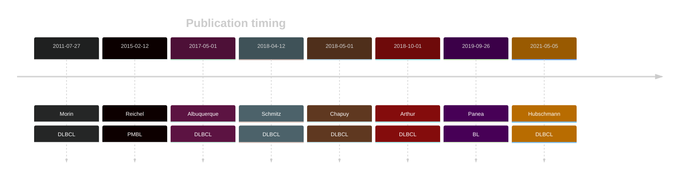
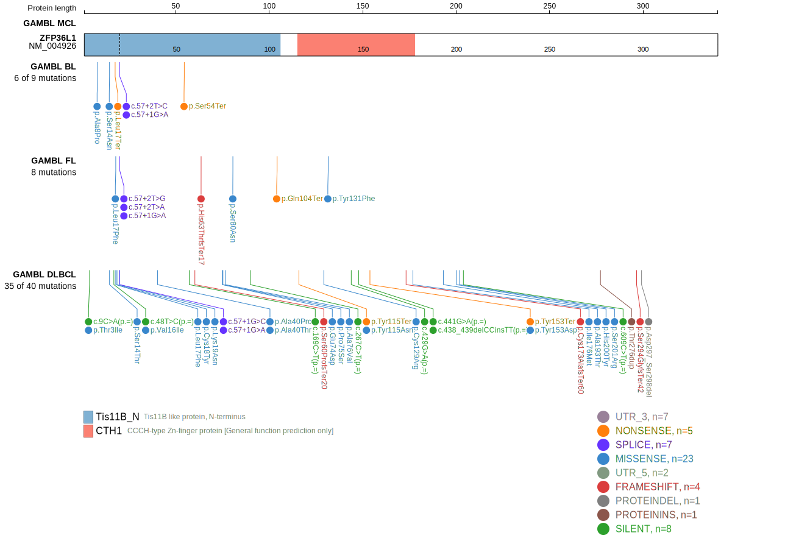
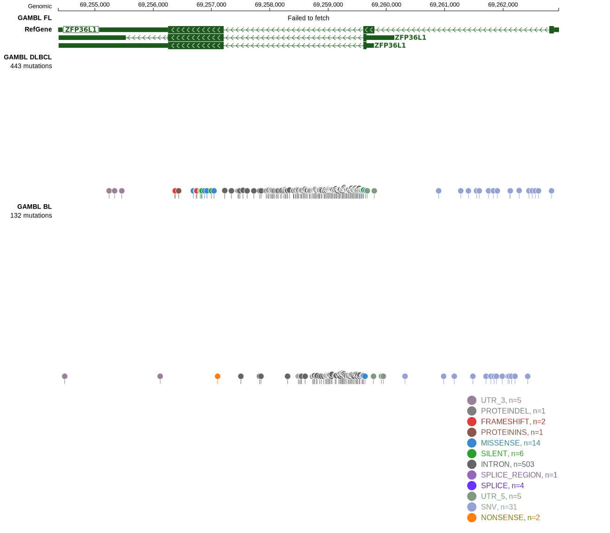
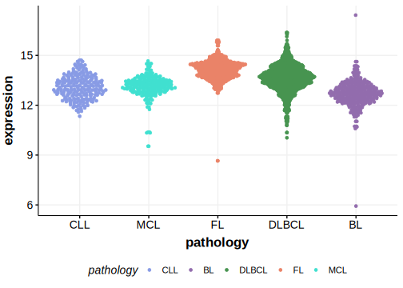

# ZFP36L1

## Overview
ZFP36L1 is one of [a number of genes](https://github.com/morinlab/LLMPP/wiki/ashm) affected by aberrant somatic hypermutation in B-cell lymphomas, which complicates the interpretation of mutations at this locus.

## History

## Relevance tier by entity

|Entity|Tier|Description                           |
|:------:|:----:|--------------------------------------|
||2|relevance in MCL not firmly established|
||1|high-confidence PMBL/cHL/GZL gene[@reichelFlowSortingExome2015]|
|    |2-a | aSHM target; Although recurrent, the relevance of mutations in BL is tenuous [@paneaWholeGenomeLandscape2019]|
| |1-a | aSHM target and high-confidence DLBCL gene            [@morinFrequentMutationHistonemodifying2011]|

## Mutation incidence in large patient cohorts (GAMBL reanalysis)

|Entity|source               |frequency (%)|
|:------:|:---------------------:|:-------------:|
|BL    |GAMBL genomes+capture|2.08         |
|BL    |Thomas cohort        |2.10         |
|BL    |Panea cohort         |3.00         |
|DLBCL |GAMBL genomes        |6.69         |
|DLBCL |Schmitz cohort       |8.51         |
|DLBCL |Reddy cohort         |5.61         |
|DLBCL |Chapuy cohort        |8.12         |

## Mutation pattern and selective pressure estimates

|Entity|aSHM|Significant selection|dN/dS (missense)|dN/dS (nonsense)|
|:------:|:----:|:---------------------:|:----------------:|:----------------:|
|BL    |Yes |Yes                  |2.453           |185.809         |
|DLBCL |Yes |Yes                  |1.293           | 14.964         |
|FL    |Yes |Yes                  |7.622           |419.109         |

## aSHM regions

|chr_name|hg19_start|hg19_end|region                                                                                    |regulatory_comment|
|:--------:|:----------:|:--------:|:------------------------------------------------------------------------------------------:|:------------------:|
|chr14   |69257848  |69259739|[TSS](https://genome.ucsc.edu/s/rdmorin/GAMBL%20hg19?position=chr14%3A69257848%2D69259739)|active_promoter   |

View coding variants in ProteinPaint [hg19](https://morinlab.github.io/LLMPP/GAMBL/ZFP36L1_protein.html)  or [hg38](https://morinlab.github.io/LLMPP/GAMBL/ZFP36L1_protein_hg38.html)

View all variants in GenomePaint [hg19](https://morinlab.github.io/LLMPP/GAMBL/ZFP36L1.html)  or [hg38](https://morinlab.github.io/LLMPP/GAMBL/ZFP36L1_hg38.html)

## ZFP36L1 Expression

## References

<!-- DLBCL: morinFrequentMutationHistonemodifying2011 -->
<!-- PMBL: reichelFlowSortingExome2015a -->
<!-- BL: paneaWholeGenomeLandscape2019 -->
<!-- ORIGIN: morinFrequentMutationHistonemodifying2011 -->
