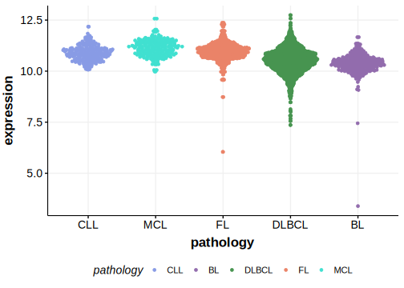

[[_TOC_]]

## Relevance tier by entity

[[include:table1_ZNF217.md]]

## Mutation incidence in large patient cohorts (GAMBL reanalysis)

### DLBCL
[[include:DLBCL_ZNF217.md]]

### FL
[[include:FL_ZNF217.md]]

### BL
[[include:BL_ZNF217.md]]

## Mutation pattern and selective pressure estimates

[[include:dnds_ZNF217.md]]

[[include:browser_ZNF217.md]]

## Expression

<!-- ORIGIN: reichelFlowSortingExome2015a -->
<!-- DLBCL: hubschmannMutationalMechanismsShaping2021b -->
<!-- PMBL: reichelFlowSortingExome2015a -->

## All Mutations

### DLBCL[@hubschmannMutationalMechanismsShaping2021]

[SP193375](https://www.bcgsc.ca/downloads/morinlab/GAMBL/MALY/SP193375.html)
[SP193725](https://www.bcgsc.ca/downloads/morinlab/GAMBL/MALY/SP193725.html)
[SP59448](https://www.bcgsc.ca/downloads/morinlab/GAMBL/MALY/SP59448.html)

[[include:mermaid_ZNF217.md]]

## References
