# ZNF217

## History

```mermaid
%%{init: { 'logLevel': 'debug', 'theme': 'dark' } }%%
timeline
    title Publication timing
      2015-02-12 : Reichel : PMBL
      2021-05-05 : Hübschmann : DLBCL
```

## Relevance tier by entity

|Entity|Tier|Description                              |
|:------:|:----:|-----------------------------------------|
||2|relevance in PMBL/cHL/GZL not firmly established[@reichelFlowSortingExome2015a]|
| |2   |relevance in DLBCL not firmly established[@hubschmannMutationalMechanismsShaping2021b]|

## Mutation incidence in large patient cohorts (GAMBL reanalysis)

|Entity|source        |frequency (%)|
|:------:|:--------------:|:-------------:|
|DLBCL |GAMBL genomes |2.10         |
|DLBCL |Schmitz cohort|2.98         |
|DLBCL |Reddy cohort  |2.90         |
|DLBCL |Chapuy cohort |2.14         |

## Mutation pattern and selective pressure estimates

|Entity|aSHM|Significant selection|dN/dS (missense)|dN/dS (nonsense)|
|:------:|:----:|:---------------------:|:----------------:|:----------------:|
|BL    |No  |No                   |1.310           |0               |
|DLBCL |No  |No                   |2.456           |0               |
|FL    |No  |No                   |0.000           |0               |

View coding variants in ProteinPaint [hg19](https://morinlab.github.io/LLMPP/GAMBL/ZNF217_protein.html)  or [hg38](https://morinlab.github.io/LLMPP/GAMBL/ZNF217_protein_hg38.html)

View all variants in GenomePaint [hg19](https://morinlab.github.io/LLMPP/GAMBL/ZNF217.html)  or [hg38](https://morinlab.github.io/LLMPP/GAMBL/ZNF217_hg38.html)

## ZNF217 Expression

<!-- ORIGIN: reichelFlowSortingExome2015a -->
<!-- DLBCL: hubschmannMutationalMechanismsShaping2021b -->
<!-- PMBL: reichelFlowSortingExome2015a -->

## All Mutations

### DLBCL2

[SP193375](https://www.bcgsc.ca/downloads/morinlab/GAMBL/MALY/SP193375.html)
[SP193725](https://www.bcgsc.ca/downloads/morinlab/GAMBL/MALY/SP193725.html)
[SP59448](https://www.bcgsc.ca/downloads/morinlab/GAMBL/MALY/SP59448.html)

## References
