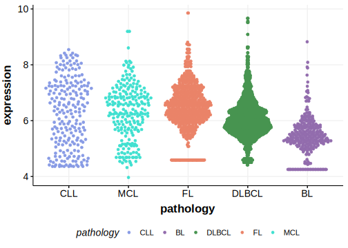

[[_TOC_]]

## Overview

Due to [minimal support](ZNF229#representative-mutation) in the original primary data, [low expression in BL](ZNF229#znf229-expression) and very few mutations reported in subsequent studies, this gene is very unlikely to be relevant in BL. 

## Relevance tier by entity

[[include:tables/table1_ZNF229.md]]

## Warnings

<<Warn("The variants reported in this gene failed QC")>>

## Mutation incidence in large patient cohorts (GAMBL reanalysis)

### BL
[[include:tables/BL_ZNF229.md]]

## Mutation pattern and selective pressure estimates

[[include:tables/dnds_ZNF229.md]]

[[include:browser_ZNF229.md]]

## Expression

<!-- ORIGIN: loveGeneticLandscapeMutations2012 -->
<!-- BL: loveGeneticLandscapeMutations2012 -->

## Representative Mutations

**Rating**
&starf; &starf; &starf; &starf; &star;

**Although well supported in the data, this mutation is clearly germline**

[[include:tables/mermaid_ZNF229.md]]

## References
