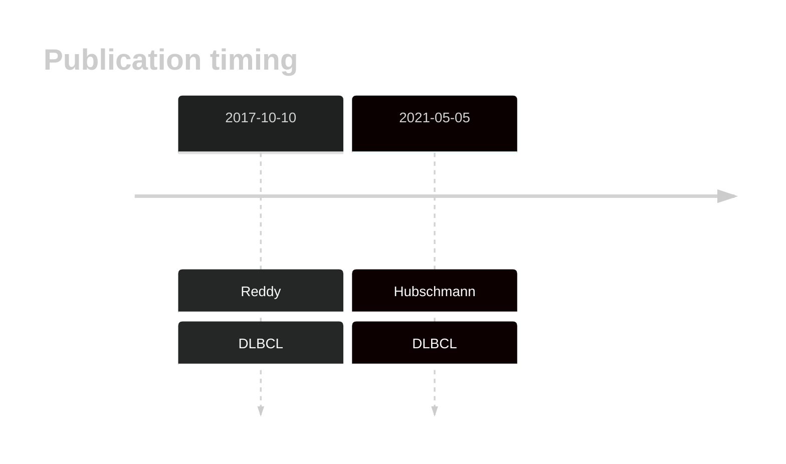

# ZNF292

## History

## Relevance tier by entity

|Entity|Tier|Description               |
|:------:|:----:|--------------------------|
| |1   |high-confidence DLBCL gene[@reddyGeneticFunctionalDrivers2017; @hubschmannMutationalMechanismsShaping2021]|

## Mutation incidence in large patient cohorts (GAMBL reanalysis)

[[include:DLBCL_ZNF292.md]]

## Mutation pattern and selective pressure estimates

|Entity|aSHM|Significant selection|dN/dS (missense)|dN/dS (nonsense)|
|:------:|:----:|:---------------------:|:----------------:|:----------------:|
|BL    |No  |No                   |1.036           | 2.462          |
|DLBCL |No  |No                   |1.272           |11.022          |
|FL    |No  |No                   |2.049           | 0.000          |

View coding variants in ProteinPaint [hg19](https://morinlab.github.io/LLMPP/GAMBL/ZNF292_protein.html)  or [hg38](https://morinlab.github.io/LLMPP/GAMBL/ZNF292_protein_hg38.html)

View all variants in GenomePaint [hg19](https://morinlab.github.io/LLMPP/GAMBL/ZNF292.html)  or [hg38](https://morinlab.github.io/LLMPP/GAMBL/ZNF292_hg38.html)

## ZNF292 Expression

<!-- ORIGIN: zhangGeneticHeterogeneityDiffuse2013 -->
<!-- DLBCL: zhangGeneticHeterogeneityDiffuse2013 -->

## References
