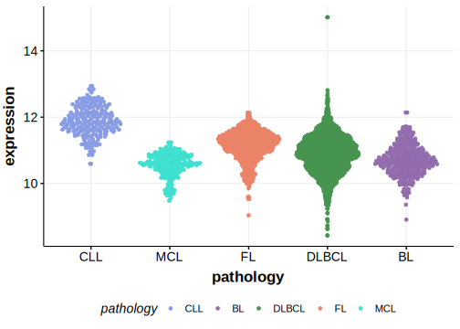

[[_TOC_]]

## Relevance tier by entity

[[include:table1_ZNF292.md]]

## Mutation incidence in large patient cohorts (GAMBL reanalysis)

[[include:DLBCL_ZNF292.md]]

## Mutation pattern and selective pressure estimates

[[include:dnds_ZNF292.md]]

[[include:browser_ZNF292.md]]

## Expression

[[include:mermaid_ZNF292.md]]

## References
