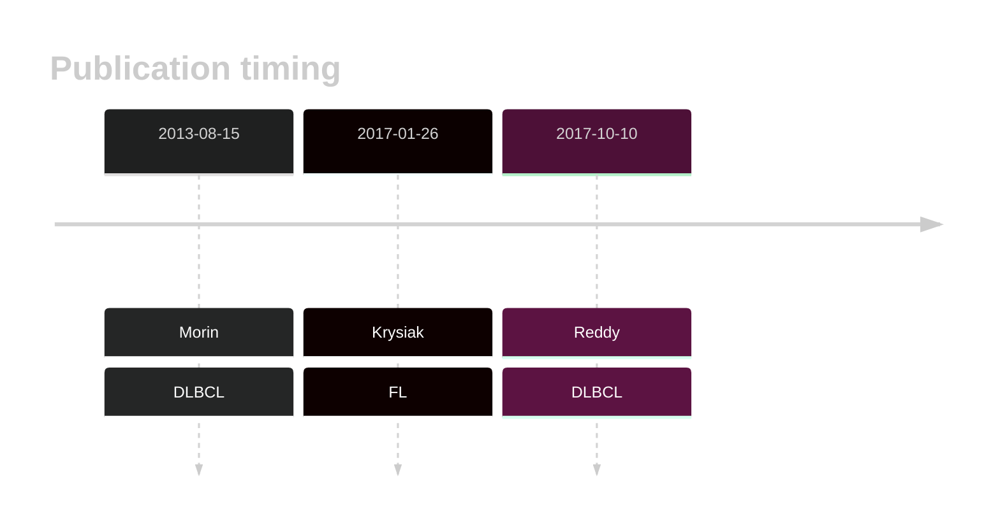
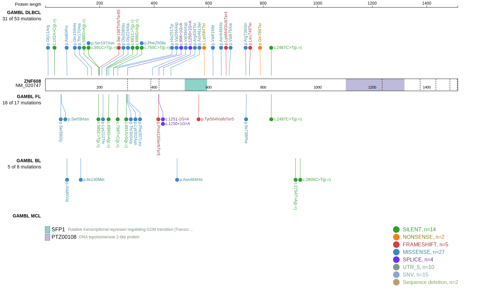
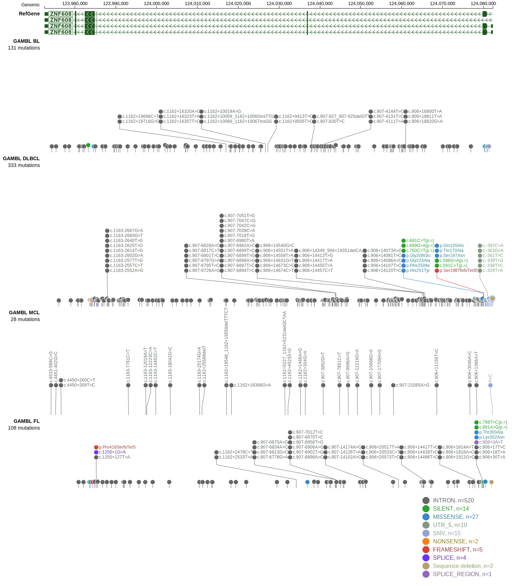
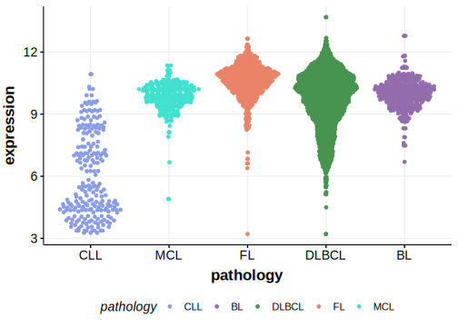

# ZNF608

## History

## Relevance tier by entity

|Entity|Tier|Description               |
|:------:|:----:|--------------------------|
||2|relevance in FL not firmly established[@krysiakRecurrentSomaticMutations2017b]|
| |1   |high-confidence DLBCL gene[@zhangGeneticHeterogeneityDiffuse2013]|

## Mutation incidence in large patient cohorts (GAMBL reanalysis)

|Entity|source        |frequency (%)|
|:------:|:--------------:|:-------------:|
|DLBCL |GAMBL genomes |6.12         |
|DLBCL |Schmitz cohort|9.36         |
|DLBCL |Reddy cohort  |8.11         |
|DLBCL |Chapuy cohort |7.69         |

## Mutation pattern and selective pressure estimates

|Entity|aSHM|Significant selection|dN/dS (missense)|dN/dS (nonsense)|
|:------:|:----:|:---------------------:|:----------------:|:----------------:|
|BL    |No  |No                   |0.986           |0.000           |
|DLBCL |No  |No                   |1.714           |3.638           |
|FL    |No  |No                   |1.867           |4.218           |

View coding variants in ProteinPaint [hg19](https://morinlab.github.io/LLMPP/GAMBL/ZNF608_protein.html)  or [hg38](https://morinlab.github.io/LLMPP/GAMBL/ZNF608_protein_hg38.html)

View all variants in GenomePaint [hg19](https://morinlab.github.io/LLMPP/GAMBL/ZNF608.html)  or [hg38](https://morinlab.github.io/LLMPP/GAMBL/ZNF608_hg38.html)

## ZNF608 Expression

<!-- ORIGIN: zhangGeneticHeterogeneityDiffuse2013 -->
<!-- FL: krysiakRecurrentSomaticMutations2017b -->
<!-- DLBCL: zhangGeneticHeterogeneityDiffuse2013 -->

## References
