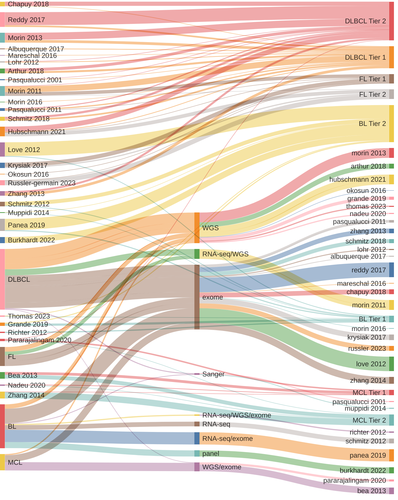

```mermaid
---
config:
  sankey:
    showValues: false
    linkColor: target
    width: 800
    height: 1000
---
sankey-beta
Pasqualucci 2001, DLBCL Tier 1, 2
Pasqualucci 2001, DLBCL Tier 2, 2
Morin 2011, DLBCL Tier 1, 24
Morin 2011, DLBCL Tier 2, 1
Morin 2016, DLBCL Tier 1, 2
Chapuy 2018, DLBCL Tier 1, 2
Chapuy 2018, DLBCL Tier 2, 17
Mareschal 2016, DLBCL Tier 1, 2
Reddy 2017, DLBCL Tier 1, 7
Reddy 2017, DLBCL Tier 2, 53
Albuquerque 2017, DLBCL Tier 1, 3
Lohr 2012, DLBCL Tier 1, 3
Lohr 2012, DLBCL Tier 2, 1
Pasqualucci 2011, DLBCL Tier 1, 2
Hubschmann 2021, DLBCL Tier 1, 3
Hubschmann 2021, DLBCL Tier 2, 20
Pararajalingam 2020, DLBCL Tier 2, 2
Morin 2013, DLBCL Tier 1, 11
Morin 2013, DLBCL Tier 2, 29
Arthur 2018, DLBCL Tier 1, 8
Arthur 2018, DLBCL Tier 2, 12
Schmitz 2018, DLBCL Tier 1, 7
Schmitz 2018, DLBCL Tier 2, 9
Pasqualucci 2011, DLBCL Tier 1, 3
Pasqualucci 2011, DLBCL Tier 2, 4
Zhang 2013, DLBCL Tier 1, 11
Zhang 2013, DLBCL Tier 2, 8
Russler-germain 2023, FL Tier 1, 1
Russler-germain 2023, FL Tier 2, 19
Hubschmann 2021, FL Tier 1, 2
Hubschmann 2021, FL Tier 2, 15
Pasqualucci 2011, FL Tier 1, 2
Krysiak 2017, FL Tier 1, 17
Krysiak 2017, FL Tier 2, 5
Okosun 2016, FL Tier 1, 2
Morin 2011, FL Tier 1, 14
Morin 2011, FL Tier 2, 1
Richter 2012, BL Tier 1, 5
Muppidi 2014, BL Tier 1, 1
Muppidi 2014, BL Tier 2, 2
Love 2012, BL Tier 1, 3
Love 2012, BL Tier 2, 56
Thomas 2023, BL Tier 1, 2
Thomas 2023, BL Tier 2, 3
Schmitz 2012, BL Tier 1, 3
Schmitz 2012, BL Tier 2, 16
Panea 2019, BL Tier 1, 4
Panea 2019, BL Tier 2, 46
Burkhardt 2022, BL Tier 2, 25
Grande 2019, BL Tier 1, 9
Grande 2019, BL Tier 2, 4
Pararajalingam 2020, MCL Tier 1, 6
Pararajalingam 2020, MCL Tier 2, 1
Bea 2013, MCL Tier 1, 11
Bea 2013, MCL Tier 2, 16
Zhang 2014, MCL Tier 1, 2
Zhang 2014, MCL Tier 2, 26
Nadeu 2020, MCL Tier 1, 3
Nadeu 2020, MCL Tier 2, 2
DLBCL, exome, 7
exome, pasqualucci 2011, 7
DLBCL, exome, 19
exome, zhang 2013, 19
DLBCL, WGS, 40
WGS, morin 2013, 40
DLBCL, exome, 16
exome, schmitz 2018, 16
DLBCL, WGS, 20
WGS, arthur 2018, 20
DLBCL, WGS, 23
WGS, hubschmann 2021, 23
DLBCL, WGS/exome, 2
WGS/exome, pararajalingam 2020, 2
DLBCL, exome, 2
exome, pasqualucci 2011, 2
DLBCL, exome, 4
exome, lohr 2012, 4
DLBCL, exome, 3
exome, albuquerque 2017, 3
DLBCL, exome, 60
exome, reddy 2017, 60
DLBCL, exome, 2
exome, mareschal 2016, 2
DLBCL, exome, 19
exome, chapuy 2018, 19
DLBCL, exome, 2
exome, morin 2016, 2
DLBCL, RNA-seq/WGS, 25
RNA-seq/WGS, morin 2011, 25
DLBCL, Sanger, 4
Sanger, pasqualucci 2001, 4
FL, RNA-seq/WGS, 15
RNA-seq/WGS, morin 2011, 15
FL, exome, 22
exome, krysiak 2017, 22
FL, WGS, 2
WGS, okosun 2016, 2
FL, WGS, 17
WGS, hubschmann 2021, 17
FL, exome, 2
exome, pasqualucci 2011, 2
FL, exome, 20
exome, russler 2023, 20
BL, Sanger, 3
Sanger, muppidi 2014, 3
BL, exome, 59
exome, love 2012, 59
BL, RNA-seq/WGS/exome, 5
RNA-seq/WGS/exome, richter 2012, 5
BL, WGS, 13
WGS, grande 2019, 13
BL, RNA-seq, 19
RNA-seq, schmitz 2012, 19
BL, RNA-seq/exome, 50
RNA-seq/exome, panea 2019, 50
BL, WGS, 5
WGS, thomas 2023, 5
BL, panel, 25
panel, burkhardt 2022, 25
MCL, WGS/exome, 27
WGS/exome, bea 2013, 27
MCL, WGS/exome, 7
WGS/exome, pararajalingam 2020, 7
MCL, WGS, 5
WGS, nadeu 2020, 5
MCL, exome, 28
exome, zhang 2014, 28
```
