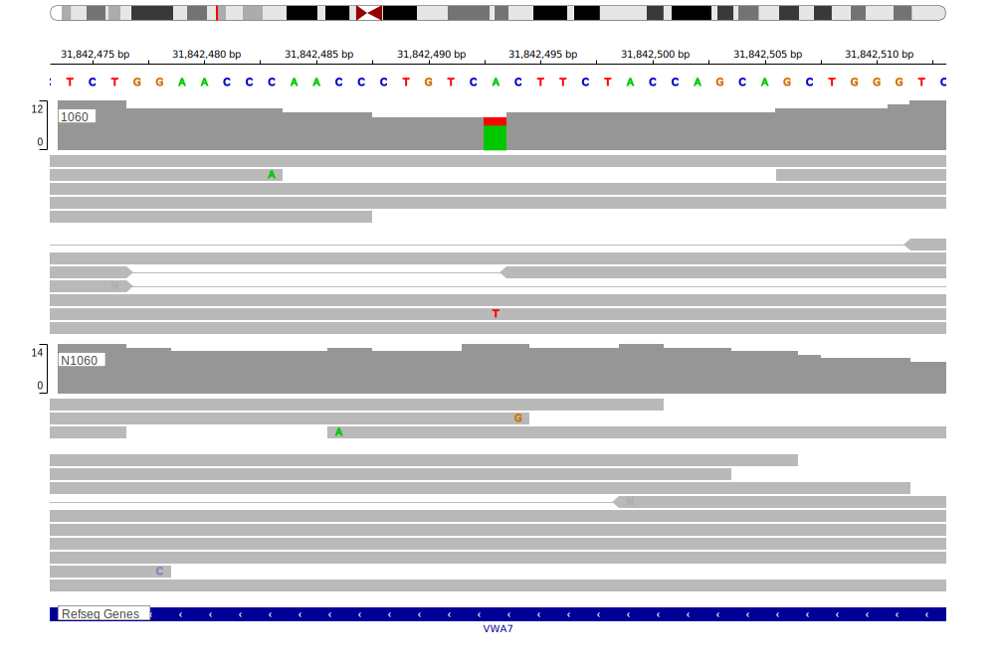

## Visualizations
### Protein
View coding variants in ProteinPaint [hg19](https://morinlab.github.io/LLMPP/GAMBL/C6orf27_protein.html)  or [hg38](https://morinlab.github.io/LLMPP/GAMBL/C6orf27_protein_hg38.html)

### Genome
View all variants in GenomePaint [hg19](https://morinlab.github.io/LLMPP/GAMBL/C6orf27.html)  or [hg38](https://morinlab.github.io/LLMPP/GAMBL/C6orf27_hg38.html)

<!-- ORIGIN: loveGeneticLandscapeMutations2012 -->
<!-- BL: loveGeneticLandscapeMutations2012 -->

## Representative Mutations

**Rating** 
&starf; &star; &star; &star; &star;

**Although well supported in the data, this mutation is clearly germline**

## All Mutations

[1060](https://www.bcgsc.ca/downloads/morinlab/GAMBL/Love/1060_reports.html)
[1102](https://www.bcgsc.ca/downloads/morinlab/GAMBL/Love/1102_reports.html)
[322](https://www.bcgsc.ca/downloads/morinlab/GAMBL/Love/322_reports.html)

[[include:mermaid_C6orf27.md]]

## References
